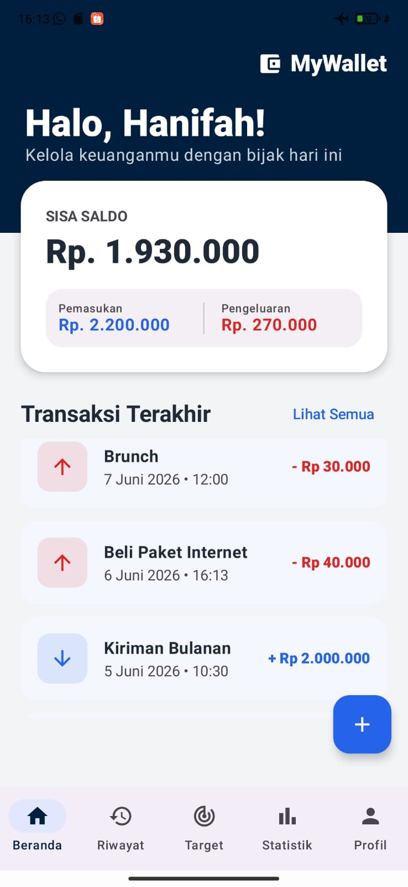
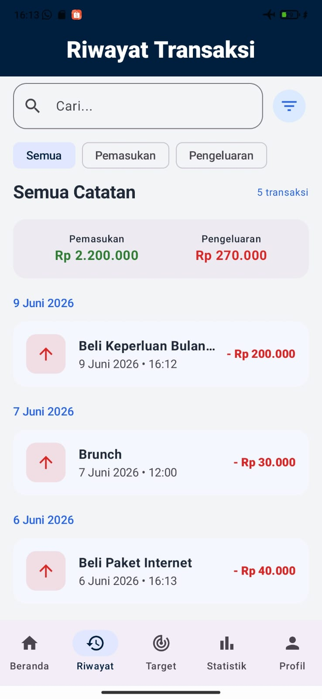
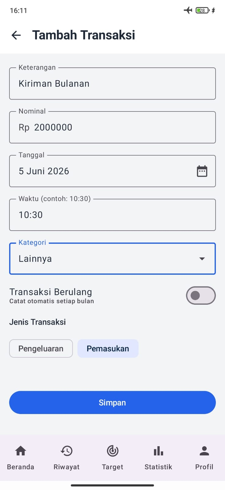
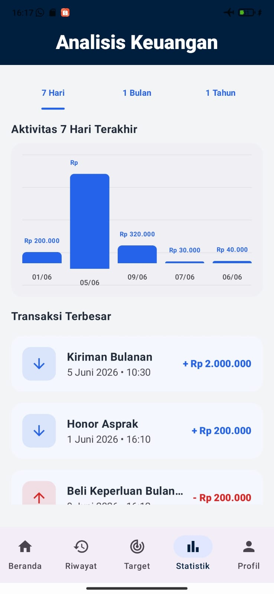
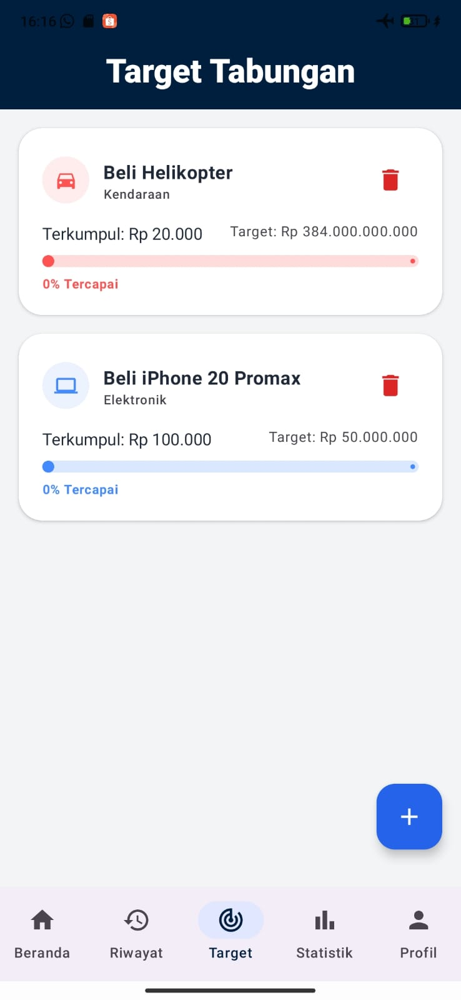
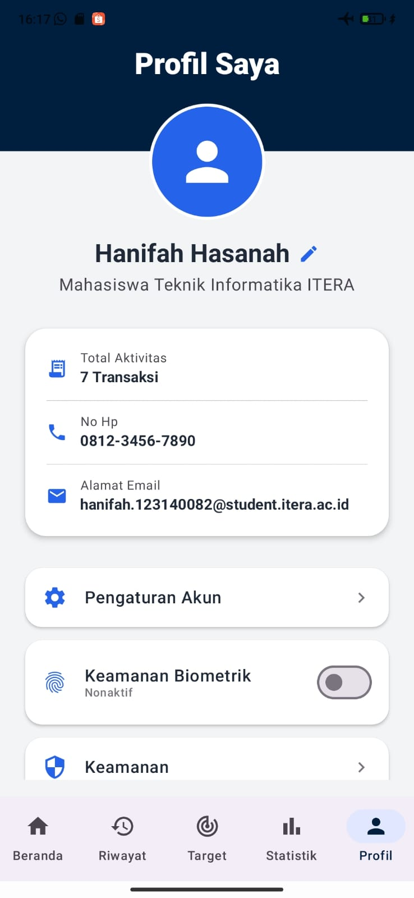
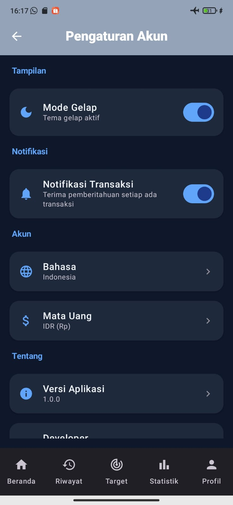
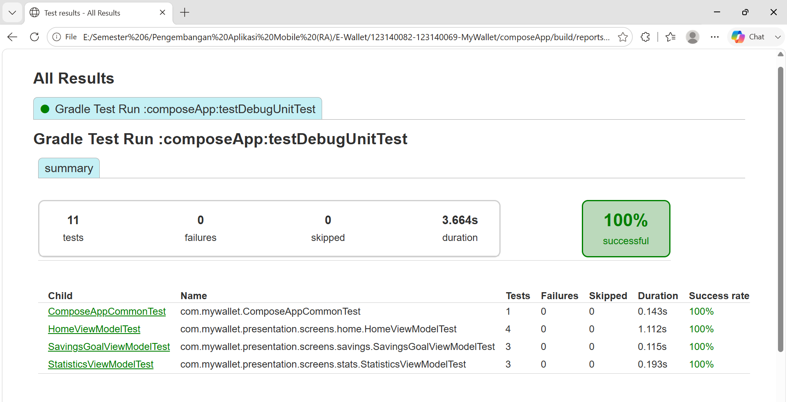

# MyWallet - Expense Tracker App


Aplikasi mobile multiplatform untuk mencatat pengeluaran, budgeting, dan melihat statistik keuangan pribadi.

---

## Tim

| Nama | NIM | GitHub |
|------|-----|--------|
| Hanifah Hasanah | 123140082 | [@HANIFAHHASANAH-123140082](https://github.com/HANIFAHHASANAH-123140082) |
| Zahwa Natasya Hamzah | 123140069 | [@15-069-ZahwaNatasyaHamzah](https://github.com/15-069-ZahwaNatasyaHamzah) |

---

## Deskripsi

MyWallet adalah aplikasi pencatat keuangan pribadi yang membantu pengguna melacak pengeluaran harian, mengatur anggaran bulanan, dan memvisualisasikan pola pengeluaran. Dibangun dengan Kotlin Multiplatform dan Compose Multiplatform.

---

## Download

▶️ [Download MyWallet APK](https://drive.google.com/file/d/1ZBrj99ZBzjfz2y7MbzOJeBXRrvIwidgb/view?usp=sharing)

---

## Video Presentasi My Wallet 123140082-123140069

▶️ [Demo My Wallet](https://youtu.be/TB6eA-g8A2g?si=4o8jKhIzQAetjd7K)

## Video Demo

- ▶️ [Demo Sprint 2 My-Wallet](https://drive.google.com/file/d/1FeOSdrNuSRtN2vJ53XGHaajSZcirldII/view?usp=drive_link)
- ▶️ [Demo Sprint 3 My-Wallet](https://drive.google.com/file/d/187kRjo8srat9RaCW-ozL4qeWrPrYVMTU/view?usp=drive_link)
- ▶️ [Demo Sprint 4 My-Wallet](https://drive.google.com/file/d/1nEzfRM7mW1XmbGsERlk2dC2HN3Lf_SMP/view?usp=drive_link)
- ▶️ [Demo Sprint 5 My-Wallet](https://drive.google.com/file/d/1AyMU6QJte6PMITo0qpcq1ZimvE490f9l/view?usp=drive_link)
---

## Screenshots

<table>
  <tr>
    <td align="center"><br/><b>Home</b></td>
    <td align="center"><br/><b>Riwayat Transaksi</b></td>
    <td align="center"><br/><b>Tambah Transaksi</b></td>
    <td align="center"><br/><b>Analisis Keuangan</b></td>
  </tr>
  <tr>
    <td align="center"><br/><b>Target Tabungan</b></td>
    <td align="center"><br/><b>Profil</b></td>
    <td align="center"><br/><b>Dark Mode</b></td>
  </tr>
</table>

---

## Fitur
### Minimum
- [x] Catat pengeluaran dengan kategori
- [x] Lihat daftar transaksi
- [x] Detail transaksi
- [x] Edit dan hapus transaksi (CRUD)
- [x] Minimal 5 screen dengan navigasi
- [x] State management dengan StateFlow + MVVM
- [x] Dependency Injection dengan Koin
- [x] Statistik pengeluaran per kategori dan per bulan
- [x] Local database dengan SQLDelight
- [x] Minimal 10 unit tests, 3 UI tests, coverage lebih dari 50%

### Bonus
- [ ] iOS Support
- [ ] AI Integration dengan Gemini API
- [x] Offline First
- [x] Dark Mode
- [ ] Animations
- [x] CI/CD
- [ ] Play Store Ready

---

## Tech Stack

| Kategori | Teknologi |
|----------|-----------|
| Framework | Kotlin Multiplatform, Compose Multiplatform |
| Architecture | MVVM, Clean Architecture, Repository Pattern |
| Async | Coroutines, Flow, StateFlow |
| Networking | Ktor Client, Kotlinx Serialization |
| Storage | SQLDelight, DataStore Preferences |
| DI | Koin |
| Testing | kotlin.test, MockK, Turbine, Compose Test |

---

## Arsitektur

Clean Architecture dengan pola MVVM:

```
commonMain/kotlin/com/mywallet/
├── data/
│   ├── local/         # SQLDelight database
│   ├── remote/        # Ktor API service
│   └── repository/    # Repository implementations
├── domain/
│   ├── model/         # Data models
│   └── repository/    # Repository interfaces
└── presentation/
    ├── screens/       # UI screens + ViewModels
    └── components/    # Reusable composables
```

---

## Setup & Cara Menjalankan

```bash
# Clone repository
git clone https://github.com/HANIFAHHASANAH-123140082/123140082-123140069-MyWallet.git
cd 123140082-123140069-MyWallet

# Checkout branch tugas
git checkout project/123140082-123140069-MyWallet

# Build debug APK
./gradlew assembleDebug

# Install ke device/emulator
./gradlew installDebug
```

---

## Cara Menjalankan Tests

### Unit Tests
```bash
# Jalankan semua unit tests
./gradlew test

# Jalankan unit test spesifik
./gradlew :composeApp:testDebugUnitTest
```
## Test Results



- Unit Tests: 11 tests, 0 failures, 100% 
- UI Tests: 6 tests (HomeScreenUiTest, SavingsGoalUiTest, StatisticsUiTest)
### UI Tests (Instrumented)
```bash
# Pastikan emulator/device sudah terhubung, lalu jalankan:
./gradlew :composeApp:connectedAndroidTest
```

### Coverage Report
```bash
# Generate laporan coverage
./gradlew koverHtmlReport

# Hasil tersimpan di:
# composeApp/build/reports/kover/html/index.html
```

---

## Struktur Tests

### Unit Tests (commonTest) - 10 Tests
| File | Jumlah Test | Yang Diuji |
|------|-------------|------------|
| HomeViewModelTest | 4 tests | State loading, balance calculation, search filter, type filter |
| StatisticsViewModelTest | 3 tests | State loading, income/expense totals, category breakdown |
| SavingsGoalViewModelTest | 3 tests | Add goal, update amount, delete goal |

### UI Tests (androidInstrumentedTest) - 6 Tests
| File | Jumlah Test | Yang Diuji |
|------|-------------|------------|
| HomeScreenUiTest | 3 tests | App launch, navigate to history, navigate to profile |
| SavingsGoalUiTest | 2 tests | Navigate to savings, add goal dialog |
| StatisticsUiTest | 1 test | Navigate to statistics |

---

## Sprint Progress

| Sprint | Minggu | Target | Status |
|--------|--------|--------|------|
| Sprint 1 | W11 | Planning, setup repo, CI/CD, arsitektur dasar | Done |
| Sprint 2 | W12 | Core features: screens, navigasi, data layer, CRUD | Done |
| Sprint 3 | W13 | API integration, search, offline support, dark mode | Done |
| Sprint 4 | W14 | UI polish, bug fixes, testing | Done |
| Sprint 5 | W15 | Final preparation, demo prep | Done |
| UAS | W16 | Final Demo Day | Upcoming |

---

