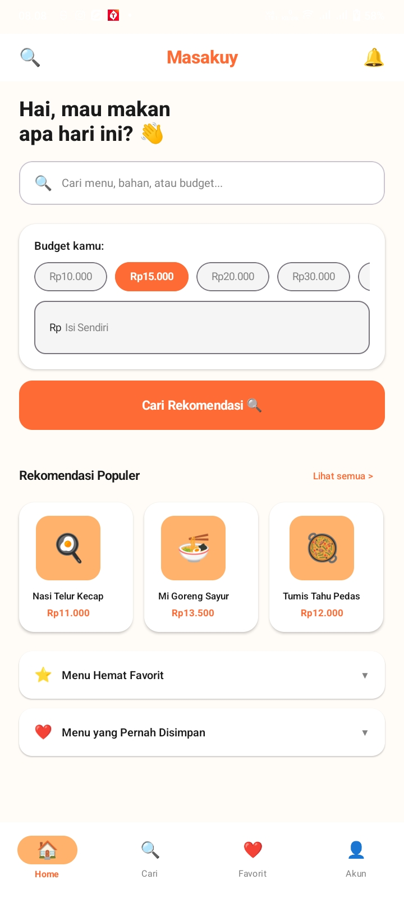
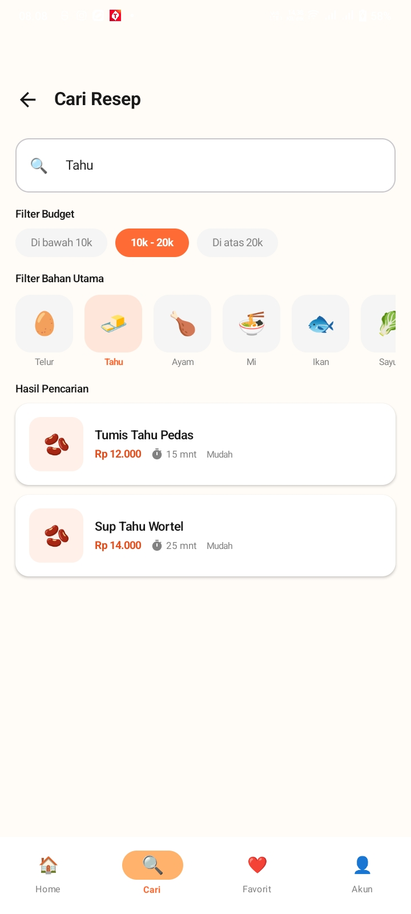
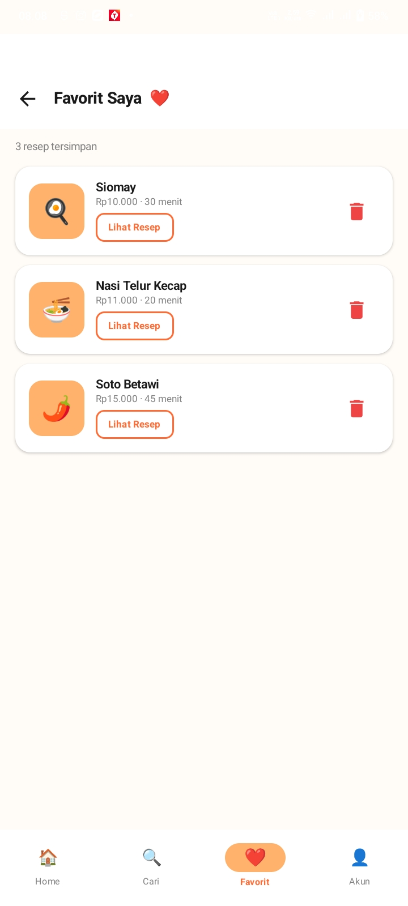
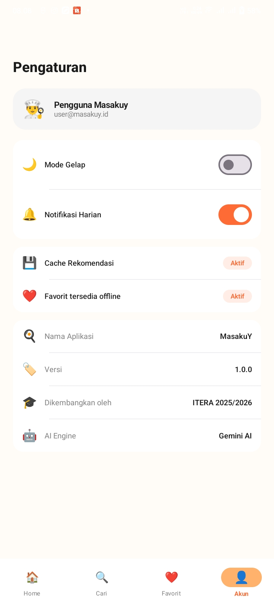

# 🍳 MasaKuy

Aplikasi rekomendasi resep masakan berbasis AI yang membantu pengguna menemukan resep sesuai budget, bahan yang tersedia, dan tingkat kesulitan yang diinginkan.

<p align="center">
  
  
  
  
</p>

## 👥 Team

| NIM | Nama | Role |
|-----|------|------|
| 123140133 | Silvia | @Silvia-vyA |
| 123140180 | Mega Zayyani | @github-username |

## 📝 Description

MasaKuy adalah aplikasi mobile yang membantu pengguna—terutama mahasiswa dan masyarakat dengan budget terbatas—menemukan resep masakan rumahan yang sesuai dengan anggaran dan bahan yang dimiliki. Pengguna cukup memasukkan budget dan bahan yang tersedia, lalu aplikasi akan memberikan rekomendasi resep lengkap dengan estimasi biaya, waktu memasak, tingkat kesulitan, daftar bahan, dan langkah-langkah pembuatan menggunakan bantuan AI (Gemini).

## ✨ Fitur & Tampilan Aplikasi

### 🏠 Home
Halaman utama menyapa pengguna dengan pertanyaan "Hai, mau makan apa hari ini?" dan menyediakan kolom pencarian cepat (menu, bahan, atau budget). Terdapat pilihan budget cepat (Rp10.000 / Rp15.000 / Rp20.000 / Rp30.000) atau input manual, lalu tombol "Cari Rekomendasi" untuk meminta rekomendasi resep dari AI. Di bawahnya ditampilkan "Rekomendasi Populer" berupa kartu-kartu resep dengan estimasi harga, serta dua section yang bisa di-expand: "Menu Hemat Favorit" dan "Menu yang Pernah Disimpan".

### 🔍 Cari Resep
Halaman pencarian dengan kolom input nama resep/bahan, filter budget (Di bawah 10k / 10k-20k / Di atas 20k), dan filter bahan utama berupa chip-chip (Telur, Tahu, Ayam, Mi, Ikan, Sayur, dst). Hasil pencarian ditampilkan dalam bentuk list card yang menampilkan nama resep, estimasi harga, waktu memasak, dan tingkat kesulitan.

### ❤️ Favorit Saya
Menampilkan daftar resep yang telah disimpan pengguna, lengkap dengan jumlah resep tersimpan, estimasi harga, dan waktu memasak untuk masing-masing resep. Setiap item memiliki tombol "Lihat Resep" untuk membuka detail, dan ikon hapus (tempat sampah) untuk menghapus dari favorit.

### ⚙️ Pengaturan
Berisi informasi profil pengguna, toggle Mode Gelap dan Notifikasi Harian, status fitur Cache Rekomendasi dan Favorit Tersedia Offline, serta informasi aplikasi (nama, versi, pengembang, dan AI engine yang digunakan — Gemini AI).

### 📄 Detail Resep
Menampilkan ikon ilustrasi resep, nama resep, chip info (estimasi biaya, waktu memasak, tingkat kesulitan), daftar bahan-bahan dengan estimasi harga masing-masing, langkah-langkah "Cara Membuat" bernomor, dan tombol untuk menyimpan/menghapus dari favorit.

### Navigasi
Aplikasi menggunakan bottom navigation bar dengan 4 menu utama: **Home**, **Cari**, **Favorit**, dan **Akun** (Pengaturan).

## 🛠 Tech Stack

- **Kotlin Multiplatform (KMP)** — shared business logic
- **Compose Multiplatform** — UI declarative cross-platform
- **Ktor** — HTTP client untuk komunikasi dengan API
- **SQLDelight** — local database untuk data favorit
- **Koin** — dependency injection
- **Coroutines & Flow** — asynchronous programming & reactive state
- **Google Gemini API** — AI untuk rekomendasi resep
- **MockK, kotlinx-coroutines-test, kotlin.test** — unit testing

## 🏗 Architecture

Project ini menggunakan **Clean Architecture** dengan pemisahan layer berikut:

```
UI Layer (Compose)
  - Screens (Recommendation, Detail, Favorite)
  - ViewModels (StateFlow-based UI State)
        |
        v
Domain Layer
  - Use Cases (GetRecommendationUseCase, GetRecipeDetailUseCase,
                GetRecipesUseCase, SaveFavoriteUseCase)
  - Domain Models (Recipe, dll)
        |
        v
Data Layer
  - Repository (implementasi domain repository interface)
  - Remote: Ktor client -> Gemini API
  - Local: SQLDelight database
```

Setiap layer berkomunikasi melalui `Result<T>` (Loading, Success, Error) yang dialirkan menggunakan `Flow`, sehingga UI dapat merespons perubahan state secara reaktif.

## 🚀 Getting Started

### Prasyarat

- Android Studio (versi terbaru, dengan plugin Kotlin Multiplatform)
- JDK 17+
- Android SDK (minSdk & targetSdk sesuai `libs.versions.toml`)
- Gemini API Key dari [Google AI Studio](https://aistudio.google.com/)

### Instalasi

1. Clone repository ini
   ```bash
   git clone <repo-url>
   cd Proyek-Pengembangan-Aplikasi-Mobile
   ```

2. Buat file `local.properties` di root project (jika belum ada), lalu tambahkan:
   ```properties
   GEMINI_API_KEY=your_gemini_api_key_here
   BASE_URL=https://generativelanguage.googleapis.com/
   ```

3. Buka project di Android Studio, biarkan Gradle sync selesai

4. Jalankan di device/emulator
   ```bash
   ./gradlew :composeApp:installDebug
   ```

### Menjalankan Test

```bash
# Jalankan semua unit test
./gradlew testDebugUnitTest

# Generate laporan code coverage (Kover)
./gradlew koverHtmlReport
```

Laporan coverage dapat dilihat di `composeApp/build/reports/kover/html/index.html`.

### Build Release APK

```bash
./gradlew assembleRelease
```

Output APK berada di `composeApp/build/outputs/apk/release/composeApp-release.apk`.

## 📦 Download

[Link ke APK release atau Play Store]

## 📸 Screenshots

| Home | Cari Resep | Favorit Saya | Pengaturan |
|------|------------|--------------|------------|
|  |  |  |  |
| Beranda dengan input budget dan rekomendasi populer | Pencarian resep dengan filter budget & bahan utama | Daftar resep yang disimpan ke favorit | Pengaturan tema, notifikasi, dan info aplikasi |

## 🧪 Code Coverage

[Screenshot laporan coverage di sini]

## 🔮 Future Plans

- Sinkronisasi favorit ke cloud (multi-device)
- Dukungan iOS
- Filter resep berdasarkan kategori (sarapan, makan siang, dll)
- Mode offline penuh dengan cache resep populer

## 🙏 Acknowledgements

Proyek ini dikembangkan sebagai bagian dari mata kuliah **Pengembangan Aplikasi Mobile (IF25-22017)**, Program Studi Teknik Informatika, Institut Teknologi Sumatera.
