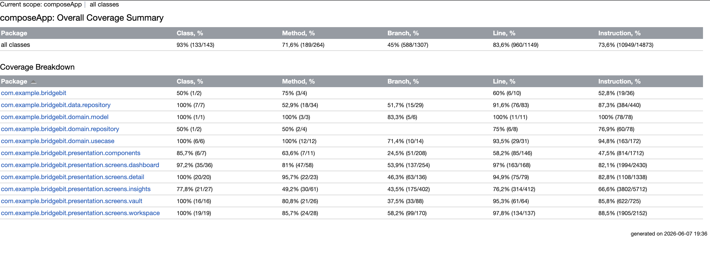

# BridgeBit
[](https://github.com/arrauf02/Proyek-Pengembangan-Aplikasi-Mobile/actions/workflows/ci.yml)

## Team
- Ar'rauf Setiawan Muhammad Jabar (Domain + Data layer, Database, API) - @arrauf02
- Muhammad Daffa Hakim Matondang (Presentation layer, UI/UX, Testing) - @dakim777

## Description
BridgeBit adalah aplikasi penerjemah cerdas berbasis AI yang dirancang untuk memberikan terjemahan kontekstual dan mendalam. Menggunakan Kotlin Multiplatform, aplikasi ini bertujuan membantu pengguna memahami nuansa bahasa, istilah teknis, dan menyediakan asisten belajar pribadi melalui asisten AI yang terintegrasi secara cerdas.


## Demo
Link Demo Sprint 2: [https://youtube.com/shorts/ngfyzMd6CXk?feature=share]
Video Tes Coverage dan UI Polish Test Sprint 4 PAM: [https://youtu.be/OUmG4H25QWI]

## Features
- [ ] **Contextual Translation**: Menerjemahkan teks dengan mempertimbangkan nuansa formal atau santai menggunakan Gemini API.
- [ ] **Phrase Vault**: Menyimpan hasil terjemahan penting ke database lokal untuk akses luring.
- [ ] **Categorization**: Mengelompokkan kata atau frasa tersimpan ke dalam kategori khusus (misal: IT, Medis, Kuliah).
- [ ] **History Dashboard**: Menampilkan riwayat terjemahan terakhir yang dilakukan pengguna.
- [ ] **AI Context Assistant**: Fitur chat interaktif untuk menanyakan detail tata bahasa atau alasan pemilihan kata oleh AI.
- [ ] **Learning Insights**: Statistik harian tentang perkembangan kosakata yang dipelajari.
- [ ] **AI-Generated Quiz**: Kuis otomatis yang dibuat berdasarkan kata-kata yang paling sering dicari atau disimpan oleh pengguna.

## 📁 Struktur Project

```
composeApp/src/
├── commonMain/
│   ├── kotlin/com/example/bridgebit/
│   │   ├── core/                      # Utilitas, Network (Ktor), dan Koin DI
│   │   │   ├── di/                    # Modul dependency injection (AppModule.kt)
│   │   │   ├── network/               # Konfigurasi API & HttpClient
│   │   │   └── util/                  # Ekstensi & expect/actual classes
│   │   │
│   │   ├── data/                      # Data layer (Local, Remote, Repository Impl)
│   │   │   ├── local/                 # Database Entity & DataStore Preferences
│   │   │   ├── remote/                # DTOs & GeminiService API
│   │   │   └── repository/            # Implementasi Translation & AI Repository
│   │   │
│   │   ├── domain/                    # Domain layer (Kotlin murni)
│   │   │   ├── model/                 # Domain models (Translation)
│   │   │   ├── repository/            # Interfaces untuk Repository
│   │   │   └── usecase/               # Logika Bisnis (SaveTranslation, SearchHistory, dll)
│   │   │
│   │   ├── presentation/              # Presentation layer (UI & State)
│   │   │   ├── components/            # Komponen UI Reusable (TranslationCard, Loading, dll)
│   │   │   ├── navigation/            # Setup Navigasi (AppNavHost, Routes)
│   │   │   ├── screens/               # Compose Screens & ViewModels
│   │   │   │   ├── dashboard/         # Halaman Beranda & Riwayat
│   │   │   │   ├── detail/            # Halaman Detail Terjemahan
│   │   │   │   ├── insights/          # Halaman Statistik & Kuis AI
│   │   │   │   ├── vault/             # Halaman Frasa Tersimpan (Vault)
│   │   │   │   └── workspace/         # Halaman Input & Terjemahan Baru
│   │   │   └── theme/                 # Konfigurasi Material 3 Theme & Spacing
│   │   │
│   │   └── App.kt                     # Main Compose entry point & Bottom Navigation
│   │
│   └── sqldelight/com/example/bridgebit/data/local/
│       └── BridgeBit.sq               # Skema database SQLDelight
│
├── commonTest/kotlin/                 # Pengujian untuk logika Shared/Common
│
├── androidMain/                       # Implementasi spesifik Android
│   ├── AndroidManifest.xml
│   ├── res/                           # Resources Android (strings, themes)
│   └── kotlin/com/example/bridgebit/
│       ├── MainActivity.kt            # Entry point Activity Android
│       ├── NoteAIApplication.kt       # Inisialisasi awal aplikasi Android
│       └── core/ & data/              # Implementasi actual Android (Driver DB, DataStore)
│
├── androidUnitTest/kotlin/            # Kumpulan Unit Test (Presentation, Domain, Data)
│
└── iosMain/kotlin/                    # Implementasi spesifik iOS
    ├── MainViewController.kt          # Entry point UIViewController iOS
    └── core/ & data/                  # Implementasi actual iOS (Driver DB, DataStore)
```
## Tech Stack
KMP, Compose Multiplatform, Ktor, SQLDelight, Koin, Gemini API

## Architecture
Aplikasi ini mengadopsi **Clean Architecture** yang dipadukan dengan pola **MVVM** (Model-View-ViewModel) untuk memastikan pemisahan tanggung jawab yang jelas antara logika bisnis, data, dan antarmuka pengguna.

- **Presentation Layer**: UI menggunakan Compose Multiplatform dan State management menggunakan StateFlow di dalam ViewModel.
- **Domain Layer**: Berisi logika bisnis murni, Use Cases, dan interface Repository.
- **Data Layer**: Implementasi Repository yang mengelola sumber data lokal (SQLDelight) dan remote (Ktor untuk Gemini API).

## Testing & Coverage
Aplikasi BridgeBit dilengkapi dengan pengujian (*Unit Test* dan *UI Test*) menggunakan JUnit 4, MockK, dan Robolectric. 

### Kover Coverage Report
Berikut adalah status cakupan pengujian (*Test Coverage*) terakhir berdasarkan *Kover Report*:

| Module / Package | Line Coverage |
| :--- | :---: |
| **Overall Project (`composeApp`)** | **83.6%** |
| `presentation.screens.dashboard` | **97.0%** |
| `presentation.screens.insights` | **76.2%** |
| `presentation.screens.vault` | **95.3%** |
| `presentation.screens.workspace` | **97.8%** |
| `presentation.screens.detail` | **94.9%** |



*(Screenshot Kover HTML Report terbaru dapat dilihat di atas, atau diakses via `build/reports/kover/htmlDebug/index.html` setelah menjalankan task Kover).*

Fokus pengujian dibagi ke dalam 3 *layer* utama:

### 1. Presentation Layer (UI & ViewModel)
- **Dashboard (`DashboardScreenTest`, `DashboardViewModelTest`):** Menguji fungsionalitas *Search Bar*, filter multi-kriteria (Vault, Kategori, Bahasa), *empty state*, serta logika *debounce* pada pencarian.
- **Workspace (`WorkspaceScreenTest`, `WorkspaceViewModelTest`):** Menguji interaksi *dropdown* bahasa, validasi tombol *translate*, *loading state*, dan logika integrasi Gemini AI serta pemanggilan fungsi simpan.
- **Vault (`VaultScreenTest`, `VaultViewModelTest`):** Memastikan frasa dikelompokkan (*grouping*) dengan benar berdasarkan kategori, menguji *empty state*, dan aksi tombol *Unvault* / Hapus.
- **Insights & AI Quiz (`InsightsScreenTest`, `InsightsViewModelTest`):** Menguji akurasi kalkulasi statistik (total, kategori favorit, distribusi topik) dan alur *AI Quiz* (mulai kuis, penanganan jawaban benar/salah, hingga perhitungan skor).
- **Detail (`TranslationDetailScreenTest`, `TranslationDetailViewModelTest`):** Menguji penanganan *Success* dan *Error state*, pengecekan label arah bahasa, serta ketersediaan tombol navigasi (Salin/Edit).

### 2. Domain Layer (Use Cases)
- **TranslationUseCases (`TranslationUseCasesTest`):** Menguji murni logika bisnis untuk fitur riwayat dan *vault* (seperti `SaveTranslation`, `SearchHistory`, `DeleteTranslation`, dll). Memastikan Use Case melempar status `Result.success` atau `Result.failure` secara akurat berdasarkan respon Repository.

### 3. Data Layer (Repository)
- **AIRepository (`AIRepositoryImplTest`):** Menguji interaksi dengan Gemini API menggunakan Ktor. Memastikan *prompting* berjalan sesuai *WritingStyle* (Formal/Casual) dan membersihkan/mem-parsing format respon AI dengan benar.
- **TranslationRepository (`TranslationRepositoryImplTest`):** Menguji pemetaan data (*mapping*) dari Domain Model ke SQLDelight Entity dan memvalidasi eksekusi *query* *database* (Insert, Update, Delete, Toggle).
## Setup
1. **Clone repo**
   ```bash
   git clone [https://github.com/arrauf02/Proyek-Pengembangan-Aplikasi-Mobile.git](https://github.com/arrauf02/Proyek-Pengembangan-Aplikasi-Mobile.git)
   cd Proyek-Pengembangan-Aplikasi-Mobile


