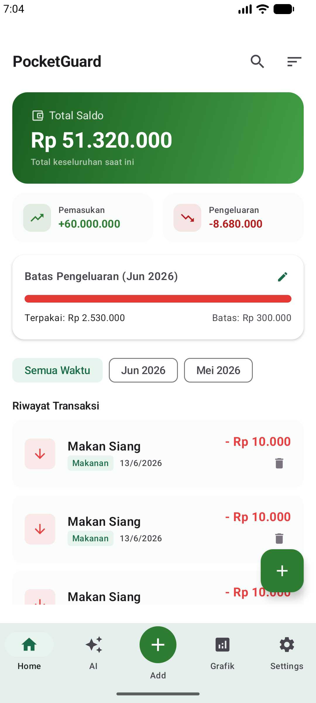
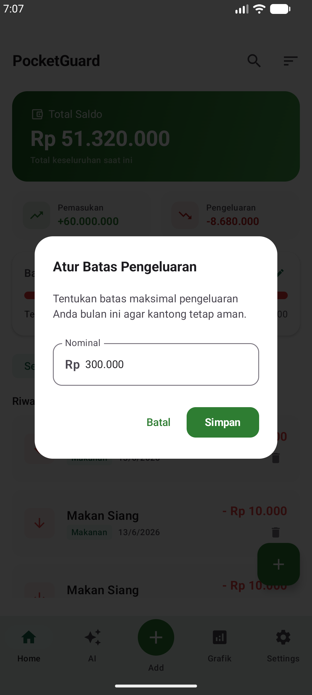
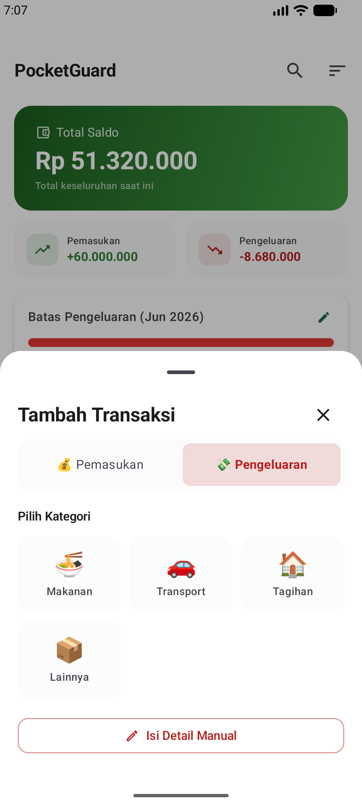
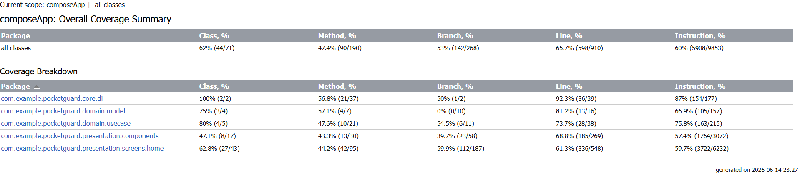

<div align="center">
  

  <h1>🛡️ PocketGuard</h1>
  <p><b>Personal Finance Tracker & Smart Budgeting</b></p>

[](#)
[](#)
[](#)
[](https://github.com/3-206-jefri/Tubes_PAM/actions)
</div>

---

## 📖 Tentang Proyek
**PocketGuard** adalah aplikasi manajemen keuangan pribadi berbasis **Kotlin Multiplatform (KMP)**. Dibangun dengan fokus pada kecepatan dan privasi (*offline-first*), aplikasi ini membantu pengguna melacak arus kas harian dan mengelola target pengeluaran bulanan melalui antarmuka yang bersih dan responsif.


### 🎬 Demo & Showcase
Lihat bagaimana PocketGuard bekerja secara langsung:
* **Final Demo Release:** [Tonton di YouTube](https://youtu.be/-NlWT6xaqNw)


---

## ✨ Fitur Utama & Pratinjau Layar
| Dashboard & Riwayat | Smart Budgeting | Pencatatan Cepat |
| :---: | :---: | :---: |
|  |  |  |

* 💸 **Dynamic Transaction:** Pisahkan pemasukan dan pengeluaran dengan kategori visual yang intuitif (Makanan, Transport, Tagihan, Gaji).
* 🎯 **Visual Budget Tracker:** Tetapkan batas pengeluaran bulanan. *Progress bar* akan beradaptasi secara visual untuk mencegah *over-budget*.
* 🔍 **Advanced Filtering:** Temukan transaksi spesifik menggunakan pencarian *real-time* atau penyaringan berdasarkan riwayat bulan.
* 🛡️ **Offline-First Vault:** Semua riwayat keuangan dienkripsi dan disimpan secara lokal di memori perangkat pengguna, memastikan privasi total.

---

## 🛠️ Arsitektur & Teknologi

PocketGuard mengimplementasikan **Clean Architecture** (Domain, Data, Presentation) yang digabungkan dengan pola **MVVM** untuk memastikan skalabilitas kode.

**Core Stack:**
* **UI Toolkit:** Jetpack Compose Multiplatform
* **Database Layer:** SQLDelight (Native C-Interop) 
* **Dependency Injection:** Koin 
* **Networking API:** Ktor HTTP Client 
* **Local Preferences:** Jetpack DataStore
* **Asynchronous:** Kotlin Coroutines & StateFlow


---

## 🧪 Strategi Pengujian & Koverasi Kode

Stabilitas aplikasi divalidasi melalui pengujian di berbagai lapisan:

1. **Presentation Layer:** Menggunakan **Robolectric** dan Compose UI Test untuk memvalidasi interaksi komponen UI. Skenario mencakup pengujian `EmptyState` pada layar kosong, validasi error pada fitur pencarian, dan keakuratan *formatter* mata uang pada kartu ringkasan saldo.
2. **Domain & Data Layer:** Memanfaatkan *Manual Fakes* untuk mereplikasi Repository secara aman di ekosistem KMP. Ini memastikan logika kalkulasi *budget* dan operasi CRUD database berjalan akurat melalui evaluasi *StateFlow* dengan library Turbine.

### 📊 Kover Coverage Report
Fokus pengujian (*test suite*) pada rilis ini diprioritaskan secara khusus pada *Core Logic* (Domain) dan antarmuka utama (Dashboard/Home) untuk memastikan keandalan pencatatan transaksi pengguna.

| Module / Package | Line Coverage |
| :--- | :---: |
| **Overall Project (composeApp)** | **65.7%** |
| `core.di` (Dependency Injection) | 92.3% |
| `domain.model` (Core Business Models) | 81.2% |
| `domain.usecase` (Business Logic Execution) | 73.7% |
| `presentation.components` (Reusable UI) | 68.8% |
| `presentation.screens.home` (Dashboard UI & Logic) | 61.3% |

> 💡 **Akses Laporan Lokal:** Laporan interaktif HTML yang mendalam dapat Anda akses secara lokal melalui folder `build/reports/kover/htmlDebug/index.html` setelah mengeksekusi perintah `./gradlew koverHtmlReportDebug`.

<div align="center">
  
</div>

---

## 🚀 Panduan Instalasi (Getting Started)

1. **Persiapan Sistem:** Pastikan Android Studio terbaru (Jellyfish/Koala) dan JDK 17 telah terinstal[cite: 230].
2. **Kloning Repositori:**
   ```bash
   git clone [https://github.com/3-206-jefri/Tubes_PAM.git](https://github.com/3-206-jefri/Tubes_PAM.git)
3. **Konfigurasi Kredensial (Wajib)**: Buat file local.properties di folder root dan masukkan API Key Anda untuk menghindari terekspos di Git:
   ````bash
   GEMINI_API_KEY=YOUR_API_KEY_HERE
4. **Jalankan Aplikasi**: Lakukan Sync Gradle, pilih modul `composeApp` untuk target Android, lalu tekan **Run**.

## 📥 Unduh Rilis (Production)
Aplikasi PocketGuard telah dikompilasi ke dalam versi Signed Release yang stabil.

- 📦 **Versi Saat Ini:** `v1.0.0`
- 🔗 **[Unduh PocketGuard APK di sini](https://drive.google.com/drive/folders/1QyVhWHPzpXO3Ay0HXg8HkZOknjJg3UbC?usp=drive_link)**
## 👨‍💻 Kreator
Jefri Wahyu Fernando Sembiring (@3-206-jefri)

Program Studi Teknik Informatika - Angkatan 2023 Peran: Fullstack Mobile Developer (UI/UX, Logic, & Testing)
