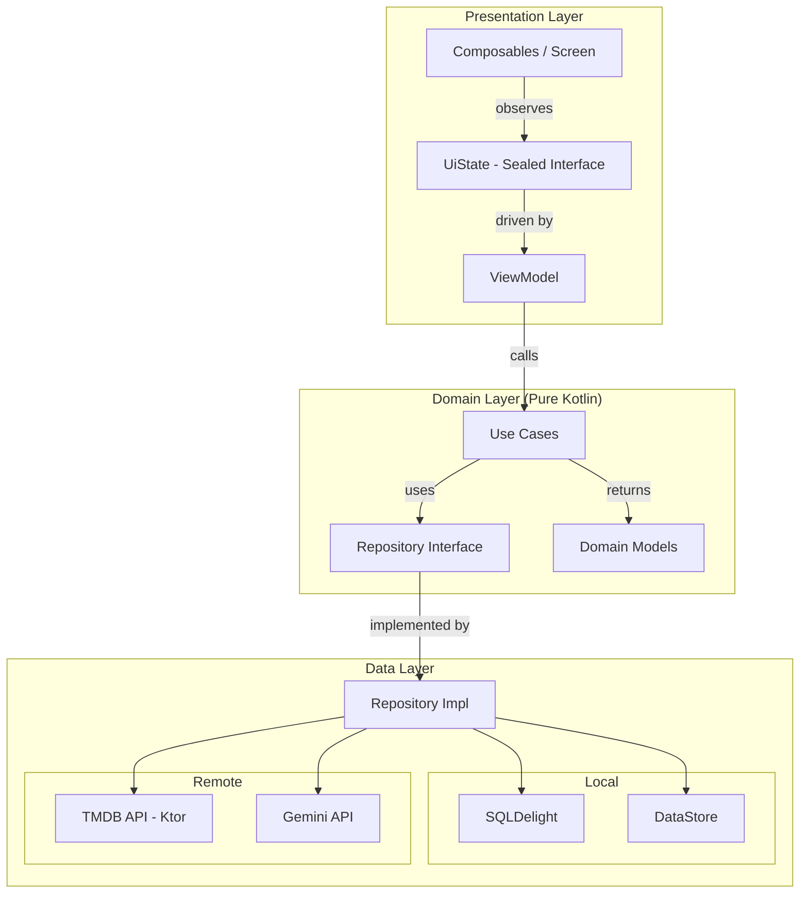

# 🎬 Rewind — Film & Series Personal Tracker


Proyek mata kuliah **Pengembangan Aplikasi Mobile (IF25-22017)** Kelas RB   
Program Studi Teknik Informatika Institut Teknologi Sumatera (ITERA)

## Anggota Kelompok

| NIM | Nama |
|-----|------|
| 123140126 | Refi Ikhsanti | 
| 123140136 | Choirunnisa Syawaldina |
| 123140142 | Keira Lakeisha Fachra Fuady |

## Tentang Aplikasi

**Rewind** adalah aplikasi mobile personal tracker untuk film dan series berbasis Kotlin Multiplatform. Pengguna bisa mencari film atau series, menambahkannya ke koleksi pribadi, mencatat status tontonan, memberi rating, dan menulis kesan singkat. Data film diambil secara real-time dari TMDB API, koleksi disimpan lokal menggunakan SQLDelight, dan dilengkapi asisten *AI berbasis Google Gemini* yang membantu menulis review dan merekomendasikan tontonan berikutnya.

## 🌟 Features

### 📦 Minimum Requirements
- [x] **Setup & Configuration** — Repository setup, Clean Architecture structure, Koin DI integration, and GitHub Actions CI pipeline.
- [x] **Search Film & Series** — Pencarian film dan series secara real-time terintegrasi dengan TMDB API.
- [x] **Koleksi Pribadi (CRUD)** — Manajemen koleksi lokal untuk menyimpan tontonan dengan status *Want to Watch, Watching, Finished, Dropped*.
- [x] **Rating & Review** — Pengguna dapat memberikan rating dan menyimpan catatan kesan singkat secara offline.
- [x] **State Management** — Implementasi UI State menggunakan `Sealed Interface` dan `StateFlow` untuk pembaruan data secara reaktif.
- [x] **Multi-screen Navigation** — Navigasi type-safe antar halaman (Home, Detail, Add/Edit) menggunakan argumen passing.

### 🎁 Bonus Features
- [x] **AI Integration (+10%)** — Integrasi Google Gemini API sebagai asisten pintar untuk membantu menulis review dan memberikan rekomendasi film.
- [x] **Offline First Support (+5%)** — Aplikasi tetap berfungsi penuh secara offline dengan sinkronisasi data lokal via SQLDelight.
- [x] **Dark Mode Support (+5%)** — Tampilan tema gelap (*twilight palette*) otomatis yang nyaman di mata untuk penggunaan larut malam.
- [x] **Animations (+5%)** — Transisi antarpahalaman dan efek animasi mikro pada komponen UI untuk meningkatkan user experience.

## 🛠️ Tech Stack
* **Framework:** Kotlin Multiplatform (KMP) & Compose Multiplatform
* **Architecture:** Clean Architecture (Domain, Data, Presentation Layers) + MVVM Pattern
* **Dependency Injection:** Koin DI Setup
* **Local Storage:** SQLDelight (SQLite Local Database) & DataStore Preferences
* **Networking:** Ktor Client & Kotlinx Serialization
* **Async:** Kotlin Coroutines & Flow (StateFlow)
* **Testing:** kotlin.test, MockK, Turbine

## 📐 Architecture Overview

Aplikasi ini menerapkan **Clean Architecture** dengan pemisahan komponen yang jelas:


## 🎬 Demo Video

https://github.com/user-attachments/assets/f2e51409-5ccb-4ddc-a641-064c27d1e5c3

https://github.com/user-attachments/assets/1207e725-c0d3-4f95-8303-b1aa204dc24a

https://github.com/user-attachments/assets/07a0acd1-b2a4-4492-9075-09447b0dc128

## Coverage Report


## 🚀 Setup & Installation
1. **Clone Repository:**
   ```bash
   git clone [https://github.com/choirunnisasy/Proyek-Pengembangan-Aplikasi-Mobile.git](https://github.com/choirunnisasy/Proyek-Pengembangan-Aplikasi-Mobile.git)
   ### Open Project:
2. Buka **Android Studio** (versi terbaru direkomendasikan).
* Pilih **Open** dan arahkan ke folder hasil clone aplikasi.
* Tunggu hingga proses *Gradle Synchronization* selesai.

3. **Run Application:**
* Pilih konfigurasi run target (`composeApp` untuk Android Emulator/Device atau Desktop).
* Klik tombol **Run** (ikon segitiga hijau).

> *Proyek ini masih dalam tahap awal pengembangan (Sprint 4).*

## 👨‍🏫 Dosen Pengampu
### Muhammad Habib Algifari, S.Kom., M.TI.
[GitHub: mh4Scripts](https://github.com/mh4Scripts)

**Program Studi Teknik Informatika** Institut Teknologi Sumatera (ITERA)
