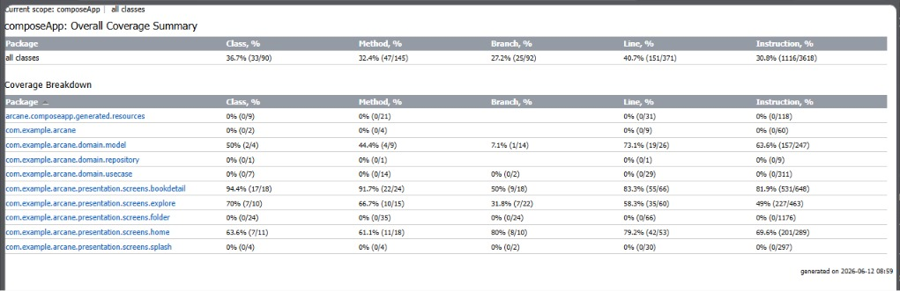
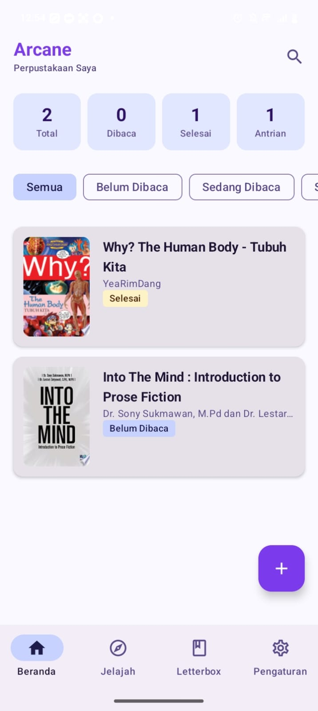
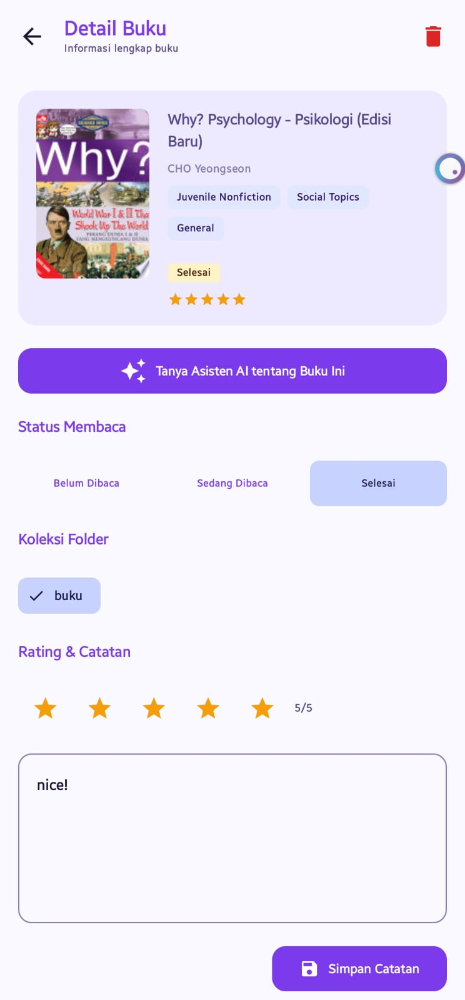
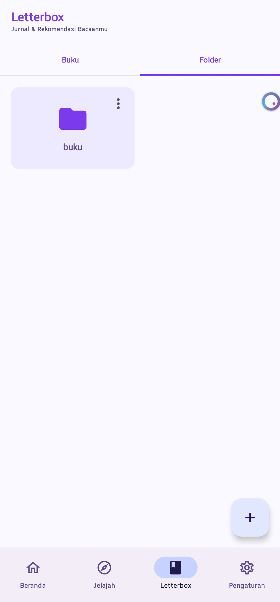
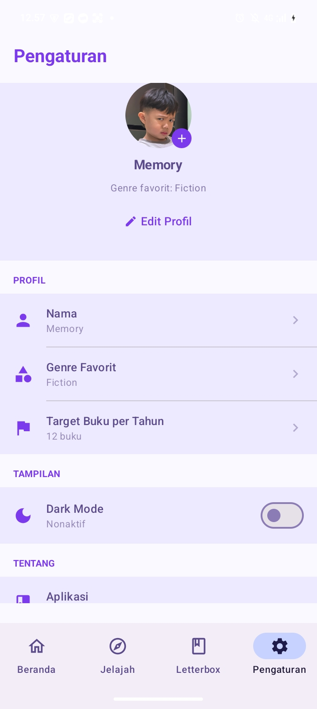
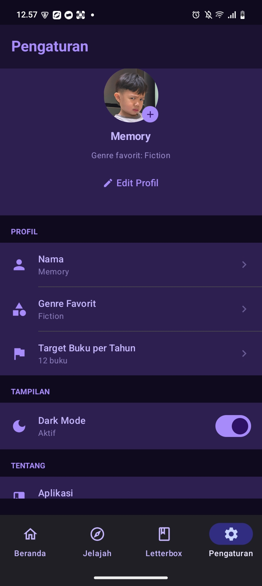
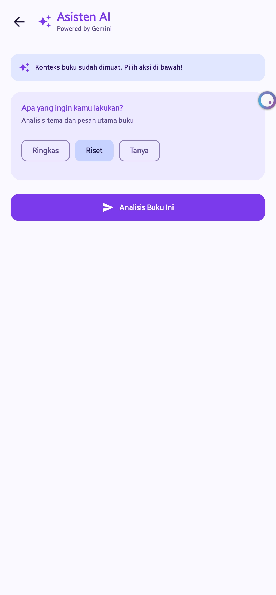
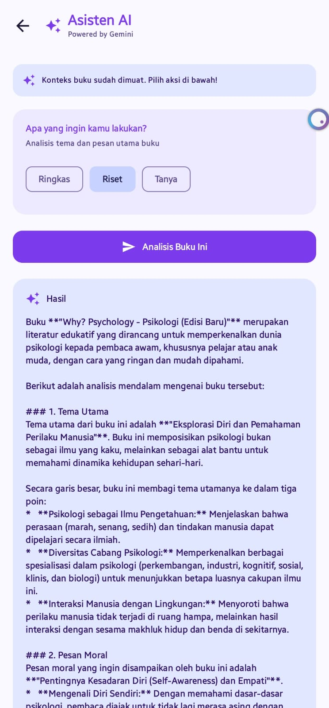
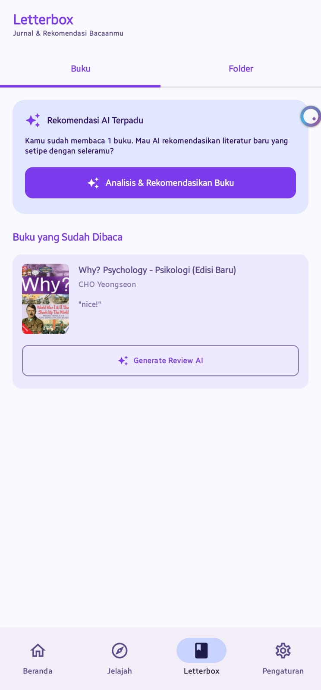

# 📱 ARCANE - Asisten Perpustakaan Digital

Aplikasi **Asisten Perpustakaan Digital** inovatif berbasis **Kotlin Multiplatform (KMP)**. ARCANE mengintegrasikan *Google Books API* dan kecerdasan buatan *Gemini AI* untuk menghadirkan pengalaman manajemen literatur yang cerdas, efisien, dan dilengkapi dengan analisis riset otomatis.

Proyek ini dikembangkan oleh **B Square** sebagai bagian dari tugas mata kuliah **Pengembangan Aplikasi Mobile** di Institut Teknologi Sumatera (ITERA).

---

## 👥 Tim Pengembang (B Square)

| Nama | NIM | GitHub | Role |
| :--- | :--- | :--- | :--- |
| **Memory Simanjuntak** | 123140095 | [13-095-memory](https://github.com/13-095-memory) | Lead Developer / UI Design |
| **Grace Exauditha Nababan** | 123140115 | [genhaa](https://github.com/genhaa) | Backend & Data |

---

## Sorotan Fitur

### Fitur Utama:
- **Modern UI/UX:** Tampilan antarmuka memukau dengan lebih dari 5 layar utama (Home, Bookshelf, Book Detail, Explore, Settings, AI Assistant) menggunakan Material Design 3 bertema ungu/indigo yang premium.
- **Data Management Cerdas:** Integrasi mulus REST API dari Google Books menggunakan Ktor, didukung dengan Database Lokal SQLDelight untuk akses data yang cepat.
- **Reactive State Management:** Menggunakan StateFlow untuk memastikan antarmuka yang sangat responsif terhadap perubahan data secara real-time.
- **Type-Safe Navigation:** Sistem navigasi antar layar yang aman dan terstruktur menggunakan Compose Navigation.

### Fitur Lanjutan (Bonus):
- **Lintas Platform:** Mendukung penuh platform **iOS** berkat arsitektur Kotlin Multiplatform.
- **Dinamis:** Dukungan *Dark Mode* dan *Light Mode* yang responsif terhadap pengaturan perangkat pengguna.
- **Asisten Riset AI:** Integrasi mendalam dengan **Google Gemini AI** untuk analisis riset, bedah literatur ilmiah, serta sintesis informasi otomatis.
- **Penyimpanan Lokal Optimal:** Penyimpanan foto profil secara lokal pada *sandbox OS* menggunakan Okio FileSystem untuk menjamin efisiensi penggunaan memori.

---

## Arsitektur & Teknologi

ARCANE dibangun di atas fondasi **Clean Architecture** dan pola **MVVM (Model-View-ViewModel)**. Ini memastikan basis kode yang sangat modular, mudah diuji (testable), dan gampang dikelola untuk jangka panjang.

### Diagram Arsitektur

```text
┌─────────────────────────────────────────────────────────────┐
│                    PRESENTATION LAYER                       │
│  ┌───────────────┐        ┌───────────────┐                 │
│  │    Screen     │◄──────►│   ViewModel   │                 │
│  │  (Composable) │ State  │  (StateFlow)  │                 │
│  └───────────────┘        └───────┬───────┘                 │
└───────────────────────────────────┼─────────────────────────┘
                                    │
┌───────────────────────────────────┼─────────────────────────┐
│                      DOMAIN LAYER │                         │
│                    ┌──────────────▼──────────────┐          │
│                    │         Use Cases           │          │
│                    │    (Business Logic)         │          │
│                    └──────────────┬──────────────┘          │
│                    ┌──────────────▼──────────────┐          │
│                    │    Repository Interface     │          │
│                    └──────────────┬──────────────┘          │
└───────────────────────────────────┼─────────────────────────┘
                                    │
┌───────────────────────────────────┼─────────────────────────┐
│                       DATA LAYER  │                         │
│                    ┌──────────────▼──────────────┐          │
│                    │   Repository Implementation │          │
│                    └──────────────┬──────────────┘          │
│              ┌────────────────────┼────────────────────┐    │
│              │                    │                    │    │
│        ┌─────▼─────┐        ┌─────▼─────┐       ┌─────▼────┐│
│        │ SQLDelight│        │   Ktor    │       │   Okio   ││
│        │  (Local)  │        │ (Remote)  │       │ (Files)  ││
│        └───────────┘        └───────────┘       └──────────┘│
└─────────────────────────────────────────────────────────────┘
```

### Tech Stack Pilihan

| Komponen | Teknologi |
|-------|------------|
| **UI Framework** | Compose Multiplatform, Material Design 3 |
| **State Management** | StateFlow, ViewModel |
| **Navigation** | Compose Navigation |
| **Networking** | Ktor Client |
| **Database Lokal** | SQLDelight |
| **Sistem File** | Okio FileSystem |
| **Dependency Injection** | Koin |
| **Kecerdasan Buatan** | Google Gemini API |
| **Testing** | Kotlin Test, Mockative, Kover |

---

## Struktur Basis Kode

Struktur folder terpusat pada `commonMain` untuk memastikan pembagian kode yang maksimal antar platform:

```text
composeApp/src/
├── commonMain/kotlin/com/example/arcane/
│   ├── core/                      # Utilitas inti, injeksi dependensi, network
│   ├── data/                      # Sumber data (API Ktor, DAO SQLDelight)
│   ├── domain/                    # Logika bisnis dan model aplikasi murni
│   └── presentation/              # Komponen UI, Layar (Home, Explore, AI), dan ViewModel
├── commonMain/sqldelight/         # Skema Database SQLDelight
├── androidMain/kotlin/            # Kode spesifik platform Android (expect/actual)
└── iosMain/kotlin/                # Kode spesifik platform iOS (expect/actual)
```

---

## Panduan Memulai

### Prasyarat

- Android Studio Ladybug (2024.2.1) atau versi lebih baru
- Xcode 15+ (Hanya untuk menjalankan target iOS)
- Java Development Kit (JDK) 17+

### Langkah-langkah Instalasi

1. **Unduh Proyek**
   ```bash
   git clone https://github.com/genhaa/Proyek-Pengembangan-Aplikasi-Mobile.git
   cd Proyek-Pengembangan-Aplikasi-Mobile
   ```

2. **Konfigurasi Kunci API (API Key)**
   Salin file konfigurasi, kemudian masukkan kunci API Gemini:
   ```bash
   cp local.properties.example local.properties
   # Buka local.properties dan tambahkan: GEMINI_API_KEY=kunci_api_anda
   ```
   *(Catatan: Anda bisa mendapatkan API key secara gratis di [Google AI Studio](https://aistudio.google.com/))*

3. **Kompilasi dan Jalankan**
   ```bash
   # Melakukan build untuk semua target platform
   ./gradlew build                       
   
   # Membangun APK versi debug secara cepat
   ./gradlew :composeApp:assembleDebug   
   ```

   - **Menjalankan di Android**: Pilih run configuration `composeApp` di Android Studio dan tekan Run (Shift+F10), atau jalankan perintah: `./gradlew :composeApp:installDebug` jika emulator/perangkat sudah aktif.

---

## Pengujian (Testing & CI/CD)

Kualitas ARCANE dijaga menggunakan **GitHub Actions** untuk alur *Continuous Integration (CI)* otomatis pada setiap *push* dan *pull request*.

### Menjalankan Pengujian Lokal:

```bash
# Pengujian Unit (Unit Test) untuk Logika Bisnis & ViewModel
./gradlew testDebugUnitTest

# Pengujian Antarmuka (Instrumented UI Test)
./gradlew connectedAndroidTest
```

### Laporan Cakupan Kode (Code Coverage)
Untuk melihat seberapa luas pengujian menjangkau kode aplikasi menggunakan Kover:
```bash
./gradlew koverHtmlReport
```
*Laporan komprehensif dalam format HTML dapat dilihat di: `composeApp/build/reports/kover/html/index.html`*



---

## 📈 Perkembangan Sprint

- [x] **Sprint 1:** Setup awal proyek, penentuan Clean Architecture, dan perancangan *Mockup* UI.
- [x] **Sprint 2:** Pengembangan fitur inti, konfigurasi penyimpanan lokal (SQLDelight), dan integrasi API Google Books.
- [x] **Sprint 3:** Integrasi Asisten Riset AI Gemini, Halaman Pengaturan (Settings), dan implementasi *Dark Mode*.
- [x] **Sprint 4:** Fase *Testing* (Unit & UI Test mencapai target coverage >50%), *Bug Fixing*, dan penyempurnaan UI.
- [x] **Sprint 5:** Perilisan aplikasi (APK), persiapan akhir untuk demonstrasi, dan penyelesaian dokumentasi (README).

---

## 📱 Screenshots

<table>
  <tr>
    <th align="center">Home Screen</th>
    <th align="center">Detail Book Screen</th>
    <th align="center">Folder Screen</th>
  </tr>
  <tr>
    <td align="center">
      
    </td>
    <td align="center">
      
    </td>
    <td align="center">
      
    </td>
  </tr>
  <tr>
    <td align="center">Halaman utama aplikasi Arcane.</td>
    <td align="center">Detail informasi buku yang dipilih.</td>
    <td align="center">Manajemen folder koleksi buku.</td>
  </tr>
</table>

<br>

<table>
  <tr>
    <th align="center">Search Bar</th>
    <th align="center">Setting Screen</th>
    <th align="center">Dark Mode</th>
  </tr>
  <tr>
    <td align="center">
      
    </td>
    <td align="center">
      
    </td>
    <td align="center">
      
    </td>
  </tr>
  <tr>
    <td align="center">Pencarian buku secara cepat.</td>
    <td align="center">Pengaturan preferensi pengguna.</td>
    <td align="center">Tampilan dark mode aplikasi.</td>
  </tr>
</table>

<br>

<table>
  <tr>
    <th align="center">Asisten AI 1</th>
    <th align="center">Asisten AI 2</th>
    <th align="center">Letterbox Screen</th>
  </tr>
  <tr>
    <td align="center">
      
    </td>
    <td align="center">
      
    </td>
    <td align="center">
      
    </td>
  </tr>
  <tr>
    <td align="center">Interaksi dengan asisten AI.</td>
    <td align="center">Lanjutan fitur asisten AI.</td>
    <td align="center">Tampilan letterbox aplikasi.</td>
  </tr>
</table>

---

## Tautan Video Demonstrasi
Saksikan bagaimana ARCANE merevolusi cara Anda membaca dan melakukan riset:
- https://youtu.be/oEA0LkJx3G4?si=-ZgSoyktMuY4y1sG

---

## Dosen Pembimbing
### Bapak Habib
[GitHub: mh4Scripts](https://github.com/mh4Scripts)

**Program Studi Teknik Informatika**  
Institut Teknologi Sumatera (ITERA)
