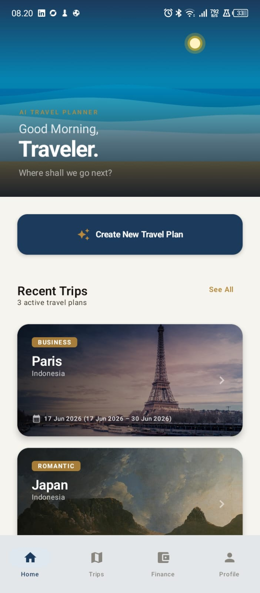
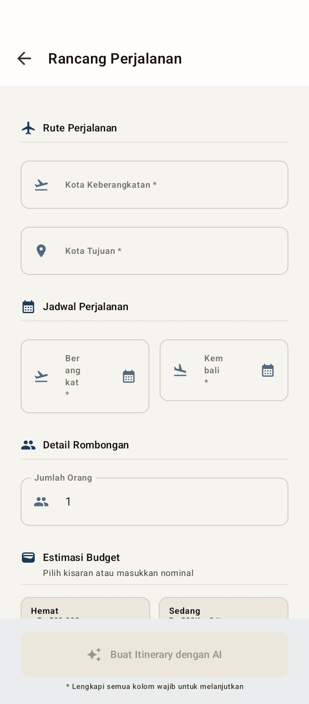
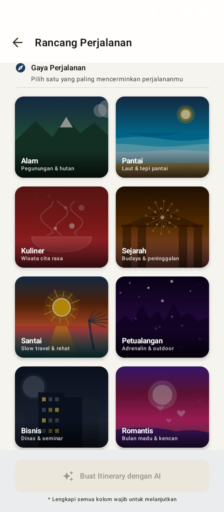
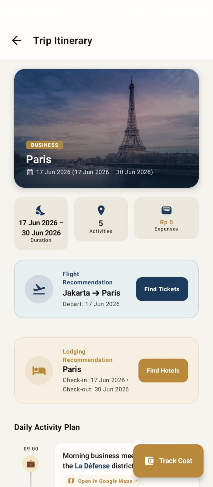
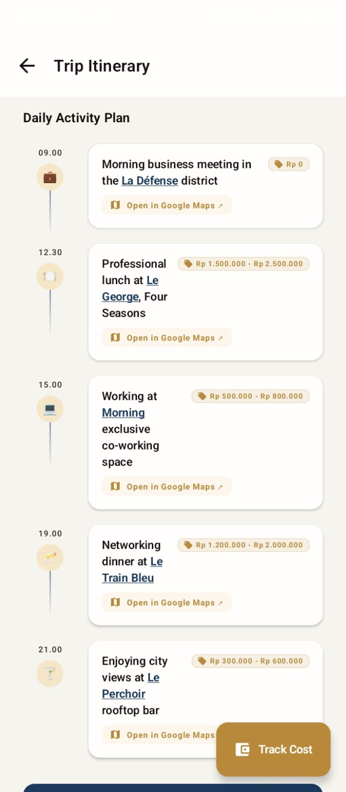
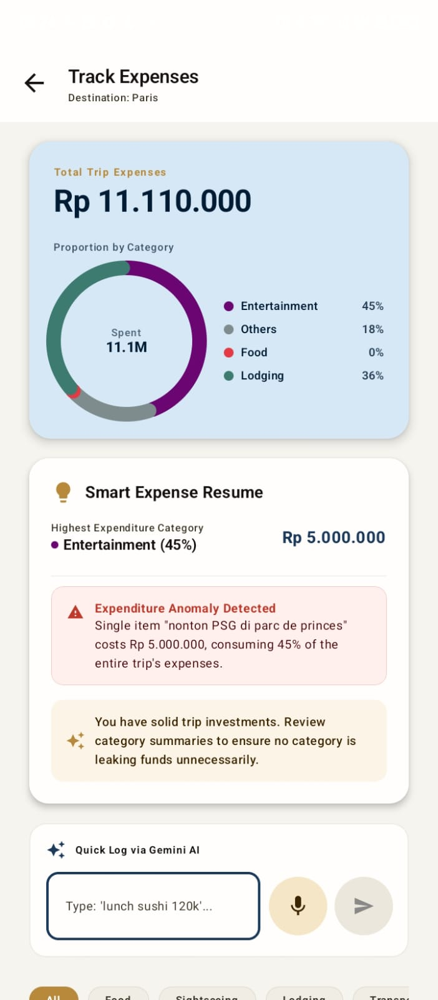
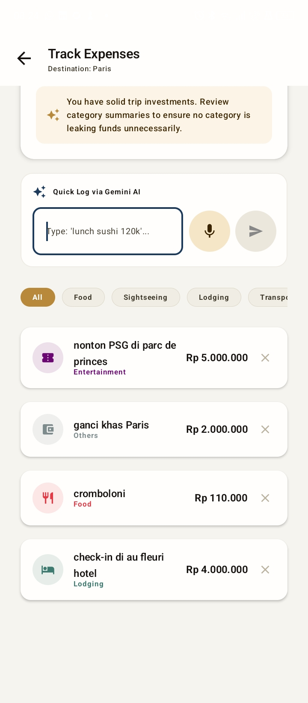
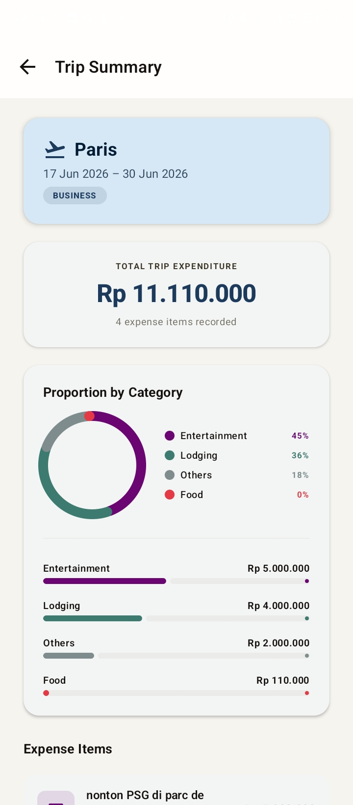
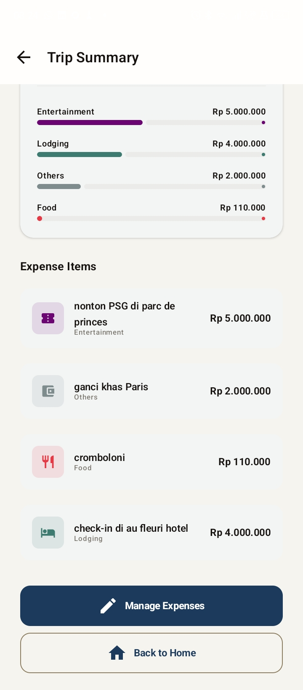
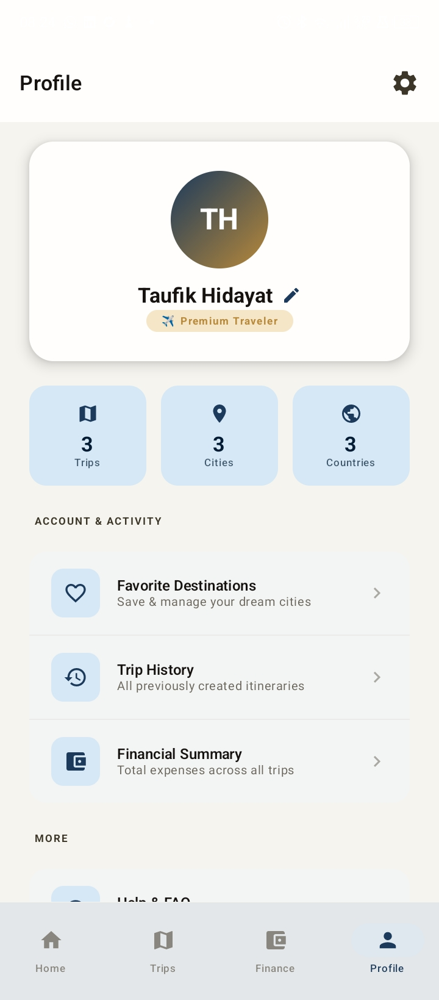

[](https://github.com/informatika-itera/Proyek-Pengembangan-Aplikasi-Mobile/actions/workflows/ci.yaml)

# AI Travel Planner

<p align="center">
  
</p>

<p align="center">
  <strong>WanderMind: Smart AI-Powered Travel Planner Assistant</strong>
</p>

---

## Video Demo
<p align="center">
  <video src="docs/full_demo_TP.mp4" width="80%" controls></video>
  <br>
  <em>Jika video di atas tidak dapat diputar langsung di browser Anda, Anda dapat mengunduh atau menontonnya di sini: <strong><a href="docs/full_demo_TP.mp4">Video Demo (full_demo_TP.mp4)</a></strong></em>
</p>

---

## Team
- **Muhammad Romadhon Santoso** - [@rmdnsantoso](https://github.com/rmdnsantoso) - FrontEnd Dev
- **Taufik Hidayat NST** - [@15-188-Taufik](https://github.com/15-188-Taufik) - Backend Dev

---

## Description
Aplikasi **AI Travel Planner** adalah asisten perencana perjalanan berbasis kecerdasan buatan (*Artificial Intelligence*) yang mengotomatisasi penyusunan *itinerary*, pencarian transportasi, rekomendasi akomodasi, dan kalkulasi biaya. Aplikasi ini dibangun secara tangguh menggunakan **Kotlin Multiplatform (KMP)** dengan kepatuhan penuh terhadap prinsip *Clean Architecture* dan pola MVVM untuk memastikan performa *native* di Android dan iOS dari satu basis kode.

Proyek ini dikembangkan sebagai pemenuhan Tugas Mata Kuliah **Pengembangan Aplikasi Mobile** di Institut Teknologi Sumatera (ITERA).

---

## Features
- **🤖 Smart AI Itinerary**: Menghasilkan jadwal perjalanan harian yang disesuaikan dengan destinasi, batas *budget*, dan preferensi wisata (seperti *healing* atau kuliner).
- **✈️ Smart Ticket & Hotel Finder**: Rekomendasi tiket transportasi dan akomodasi terkurasi yang disaring ketat berdasarkan parameter *budget* pengguna.
- **📝 CRUD Travel Notes & Wishlist**: Simpan, edit, dan kelola rencana perjalanan atau *itinerary* hasil *generate* AI ke dalam penyimpanan lokal (*offline*) yang aman.
- **💰 Deterministic Budgeting**: Rincian alokasi biaya perjalanan yang presisi, dihitung secara deterministik untuk menghindari halusinasi data AI.
- **🌙 Dynamic Theme**: Dukungan Mode Gelap/Terang adaptif berbasis Compose Multiplatform.

---

## Tech Stack
Proyek ini mengadopsi teknologi modern dalam ekosistem Kotlin Multiplatform:
- **KMP**: Kotlin Multiplatform untuk berbagi logika bisnis lintas platform (Android & iOS).
- **Compose**: Compose Multiplatform untuk pengembangan UI deklaratif yang seragam dan modern.
- **Ktor**: HTTP client untuk komunikasi data asinkronus ke server backend.
- **SQLDelight**: Database penyimpanan lokal bertipe aman (*type-safe*).
- **Koin**: Dependency Injection (DI) yang ringan dan dioptimalkan untuk Kotlin.

---

## Architecture
Aplikasi ini dirancang dengan kepatuhan tinggi terhadap prinsip **Clean Architecture** untuk pemisahan kekhawatiran (*separation of concerns*) dan kemudahan pengujian:
- **Presentation Layer**: Penanganan UI deklaratif (Compose) dan pengelolaan state berbasis StateFlow & ViewModel.
- **Domain Layer**: Logika bisnis murni (Pure Kotlin), Use Case, dan model domain murni (bebas dari dependensi platform).
- **Data Layer**: Integrasi penyimpanan lokal (SQLDelight & DataStore) dan client jaringan (Ktor Client).

```text
composeApp/src/
├── commonMain/kotlin/com/example/wandermind/
│   ├── core/                      # Utilitas Inti (di, network, util)
│   ├── data/                      # Lapisan Data (local, remote, repository)
│   ├── domain/                    # Lapisan Domain (model, repository, usecase)
│   └── presentation/              # Lapisan Presentasi (navigation, screens, components, theme)
```

---

## Getting Started
1. **Clone repo**:
   ```bash
   git clone https://github.com/informatika-itera/Proyek-Pengembangan-Aplikasi-Mobile.git
   ```
2. **Open in Android Studio**:
   Buka folder proyek menggunakan Android Studio (versi terbaru direkomendasikan).
3. **Run on device/emulator**:
   Pilih target perangkat (Android Emulator atau perangkat fisik) dan tekan tombol **Run**.

---

## Download
- **Signed Release APK**: Anda dapat membuat APK rilis secara lokal dengan menjalankan perintah Gradle berikut:
  ```powershell
  ./gradlew assembleRelease
  ```
  File APK rilis akan tersedia di: `composeApp/build/outputs/apk/release/composeApp-release.apk`
- **GitHub Releases**: Dapatkan versi pra-kompilasi terbaru secara langsung di **[Halaman Rilis GitHub](https://github.com/informatika-itera/Proyek-Pengembangan-Aplikasi-Mobile/releases)**.

---

## Screenshots
<table align="center">
  <tr>
    <td align="center" width="20%">
      <br/>
      <sub>Landing Screen</sub>
    </td>
    <td align="center" width="20%">
      <br/>
      <sub>Planner Form</sub>
    </td>
    <td align="center" width="20%">
      <br/>
      <sub>Itinerary Result</sub>
    </td>
    <td align="center" width="20%">
      <br/>
      <sub>Budget Breakdown</sub>
    </td>
    <td align="center" width="20%">
      <br/>
      <sub>Notes List</sub>
    </td>
  </tr>
  <tr>
    <td align="center" width="20%">
      <br/>
      <sub>Create Note</sub>
    </td>
    <td align="center" width="20%">
      <br/>
      <sub>Transport Finder</sub>
    </td>
    <td align="center" width="20%">
      <br/>
      <sub>Hotel Finder</sub>
    </td>
    <td align="center" width="20%">
      <br/>
      <sub>Settings</sub>
    </td>
    <td align="center" width="20%">
      <br/>
      <sub>About Page</sub>
    </td>
  </tr>
</table>
