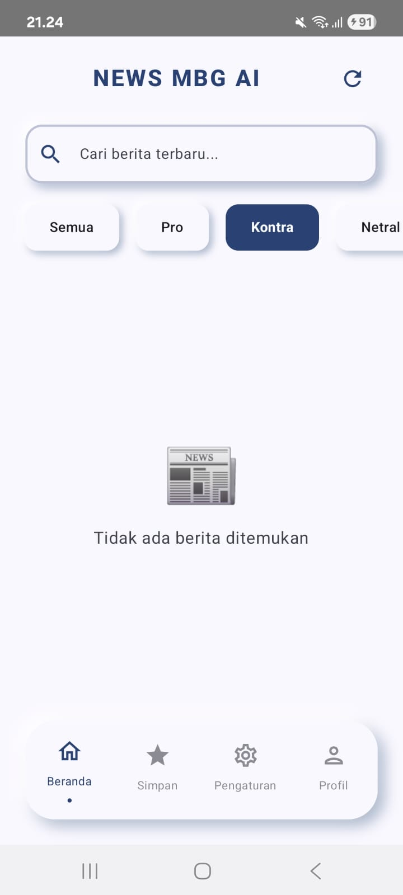

# News MBG - Premium Android News App with Gemini AI

[](https://github.com/Febvn/Proyek-Pengembangan-Aplikasi-Mobile/actions/workflows/android.yml)
[](https://kotlinlang.org/)
[](https://developer.android.com/jetpack/compose)
[](https://insert-koin.io/)
[](https://ktor.io/)
[](https://cashapp.github.io/sqldelight/)
[](https://aistudio.google.com/)

**News MBG** (Mbgnews) is a modern Android news portal application implementing **Clean Architecture** and Kotlin Multiplatform (KMP) base structure, wrapped in a premium **Neumorphism** user interface, and powered by **Google Gemini AI** for real-time news sentiment analysis and automated categorization.

This project was developed to fulfill the assignments for the **Mobile Application Development (PAM)** course at the Informatics Engineering Program, Institut Teknologi Sumatera (ITERA).

---

## 📱 App Screenshots

### Tampilan Awal - Home Screen


**Home Screen** menampilkan daftar berita dengan fitur:
- Real-time search dengan debounce
- Filter kategori berita (Semua, Pro, Kontra, Netral)
- Pull-to-refresh untuk memuat berita terbaru
- Bookmark artikel langsung dari card
- AI sentiment indicator dengan glowing shadow

### Pencarian - Search Feature


**Search Feature** memungkinkan pengguna:
- Mencari berita secara real-time
- Debounce 500ms untuk optimasi performa
- Hasil pencarian langsung ditampilkan
- Mendukung pencarian berdasarkan judul dan deskripsi

### Berita Tersimpan - Bookmark Screen


**Bookmark Screen** untuk menyimpan artikel favorit:
- Daftar artikel yang disimpan
- Hapus bookmark dengan satu klik
- Navigasi ke detail artikel
- Empty state yang informatif

### Pengaturan - Settings Screen


**Settings Screen** dengan berbagai opsi:
- Toggle mode gelap (UI ready)
- Toggle notifikasi
- Hapus cache aplikasi
- Informasi versi aplikasi

### Sentiment Analysis - Kontra Category


**AI-Powered Categorization** menunjukkan:
- Berita dengan sentiment "Kontra"
- Glowing indicator merah untuk identifikasi visual
- Filter berdasarkan kategori (Pro/Kontra/Netral)
- Gemini AI real-time analysis

---

## Key Features

1. **Premium Neumorphic UI**: A visually stunning interface utilizing Custom Compose Modifiers to create a sense of depth.
2. **Smart Gemini AI Integration**:
    * **Glowing Sentiment Indicators**: Automated news sentiment analysis (Positive, Negative, Neutral) represented by dynamic glowing shadows on the Detail page.
    * **Smart Category Updates**: Contextual text-based classification of news articles into relevant categories.
3. **Search & Category Filtering**: Instant article search functionality and horizontal category filters (All, Business, Technology, Science, Health).
4. **Local Data Management (CRUD)**: Create, Read, Update, and Delete custom articles locally using SQLDelight.
5. **Clean Architecture & MVVM**: Strict separation of code layers (`data`, `domain`, `presentation`) ensuring high maintainability and testability.

---

## Sprint 3: Advanced Features & Offline Support

Sprint 3 focuses on advanced features, offline support, and enhanced user experience with significant improvements over Sprint 2.

### Sprint 3 Deliverables

| Component | Weight | Criteria | Status | Details |
| :--- | :---: | :--- | :---: | :--- |
| **Search/Filter** | 25% | Working search, responsive, good UX | **COMPLETED** | Real-time search with 500ms debounce, category filtering (Semua/Pro/Kontra/Netral) |
| **API/Enhanced Local** | 25% | Proper integration, error handling | **COMPLETED** | Offline-first caching with Room, automatic cache on API success, graceful fallback |
| **Offline Support** | 20% | App usable offline, graceful degradation | **COMPLETED** | Cached articles load automatically, works completely offline, clear error messages |
| **Additional Screen** | 15% | Settings/Profile functional | **COMPLETED** | Complete Settings UI with dark mode toggle, notifications, cache management |
| **Bonus Features** | 15% | At least 1 bonus implemented | **ACHIEVED** | Pull-to-refresh, Share functionality, Enhanced bookmarks, Smooth animations, 4-tab navigation |

---

## What's New in Sprint 3

### Major Changes from Sprint 2

Sprint 3 transforms the application from a basic news reader into a powerful offline-capable news app with modern features and enhanced user experience.

| Feature | Sprint 2 | Sprint 3 |
|---------|----------|----------|
| **Search** | Not available | Real-time search with debounce |
| **Filter** | Not available | Category filter (Pro/Kontra/Netral) |
| **Offline Mode** | Error without internet | Works completely offline with cache |
| **Settings** | Not available | Complete settings screen |
| **Bookmark** | Only in detail screen | Quick bookmark from home + dedicated screen |
| **Pull-to-Refresh** | Not available | Swipe down to refresh |
| **Share** | Not available | Share to other apps |
| **Navigation** | 3 tabs | 4 tabs (added Settings) |
| **Cache Management** | Not available | Clear cache from settings |
| **Empty States** | Basic | Informative with proper UI |

---

## Sprint 3 Features Detailed

### 1. Search & Filter Functionality

**Implementation:**
- Real-time search with 500ms debounce for performance optimization
- Category filtering (Semua, Pro, Kontra, Netral) based on AI sentiment analysis
- Responsive UI with neumorphic design consistency
- Smooth animations and transitions

**How it works:**
1. User types in search bar
2. System waits 500ms after user stops typing (debounce)
3. Results are filtered and displayed instantly
4. Category tabs allow further filtering by sentiment

**Screenshot:**

*Real-time search feature with instant results*

---

### 2. Offline Support - Offline-First Architecture

**Implementation:**
- Automatic caching: Every loaded article is saved to local Room database
- Offline-first pattern: App automatically loads from cache when offline
- Graceful degradation: Clear error messages when cache is empty
- Cache management: Users can clear cache from Settings

**How it works:**
1. App loads articles from API with internet connection
2. Articles are automatically cached to Room database
3. When offline, app detects no connection
4. App loads articles from cache instead
5. User experience remains seamless

**Technical Details:**
```kotlin
// Offline-first implementation in Repository
override fun getMbgNews(query: String?): Flow<Result<List<Article>>> {
    try {
        // Fetch from API
        val response = api.getMbgNews(...)
        
        // Cache articles automatically
        dao.insertCachedArticles(articles)
        
        return Result.success(articles)
    } catch (e: Exception) {
        // Fallback to cache when offline
        val cached = dao.getCachedArticles().first()
        return Result.success(cached)
    }
}
```

---

### 3. Settings Screen

**Implementation:**
- Dark mode toggle UI (ready for DataStore implementation)
- Notifications toggle for news alerts
- Cache management with confirmation dialog
- App version and open source license information

**Features:**
- Neumorphic design consistency
- Organized sections (Appearance, Notifications, Storage, About)
- Confirmation dialogs for destructive actions
- Clear visual hierarchy

**Screenshot:**

*Settings screen with various configuration options*

---

### 4. Enhanced Bookmark System

**Changes from Sprint 2:**
- Sprint 2: Bookmark only available in detail screen
- Sprint 3: Quick bookmark button on every article card in home screen

**Implementation:**
- Bookmark button with star icon on each article card
- Visual feedback: Icon changes color when bookmarked
- Dedicated Bookmark screen with article list
- Delete functionality with single tap
- Empty state UI when no bookmarks exist
- Real-time state updates using StateFlow

**Screenshot:**

*Bookmark screen showing saved articles*

---

### 5. Bonus Features

#### Pull-to-Refresh
- Swipe down gesture on home screen to refresh articles
- Material Design pull-to-refresh indicator
- Smooth animation during refresh
- Fetches latest articles from API

#### Share Functionality
- Share button in article detail screen
- Opens Android native share sheet
- Shares article URL to other apps (WhatsApp, Telegram, etc.)
- Simple one-tap sharing

#### Smooth Animations
- Shimmer loading effect while fetching data
- Smooth transitions between screens
- Neumorphic shadow animations
- Pull-to-refresh animations

#### 4-Tab Bottom Navigation
- Home: Article list with search and filter
- Bookmark: Saved articles
- Settings: App configuration
- About: App information

**Screenshot:**

*Home screen with pull-to-refresh and bookmark buttons*

---

### 6. AI-Powered Sentiment Analysis

**Continued from Sprint 2 with enhancements:**
- Gemini AI categorizes articles as Pro, Kontra, or Netral
- Visual indicators with glowing shadows
- Filter articles by sentiment category
- Real-time analysis for each article

**Screenshot:**

*Articles filtered by "Kontra" sentiment with red glowing indicator*

---

## Technical Improvements in Sprint 3

### Database Enhancement
```kotlin
// Sprint 2: Version 1, bookmarks only
@Database(entities = [ArticleEntity::class], version = 1)

// Sprint 3: Version 2, bookmarks + cache
@Database(entities = [ArticleEntity::class], version = 2)
```

**New DAO Operations:**
- `getCachedArticles()`: Retrieve cached articles
- `insertCachedArticles()`: Save articles for offline use
- `clearOldCache()`: Remove old cached data
- `searchCachedArticles()`: Search within cached data

### Repository Pattern - Offline First
```kotlin
class NewsRepositoryImpl(
    private val api: NewsApi,
    private val dao: ArticleDao,
    private val geminiService: GeminiService
) : NewsRepository {
    
    override fun getMbgNews(query: String?): Flow<Result<List<Article>>> = flow {
        try {
            // 1. Fetch from API
            val response = api.getMbgNews(query = searchQuery, apiKey = apiKey)
            
            // 2. Process with Gemini AI
            val articles = response.articles.map { dto ->
                val category = geminiService.categorizeNews(...)
                dto.toDomain().copy(category = category)
            }
            
            // 3. Cache for offline use
            dao.insertCachedArticles(articles.map { it.toEntity() })
            
            // 4. Emit success
            emit(Result.success(articles))
        } catch (e: Exception) {
            // 5. Load from cache when offline
            val cachedArticles = dao.getCachedArticles().first()
            if (cachedArticles.isNotEmpty()) {
                emit(Result.success(cachedArticles.map { it.toDomain() }))
            } else {
                emit(Result.failure(Exception("No internet and cache is empty")))
            }
        }
    }
}
```

### ViewModel Enhancements
```kotlin
class NewsViewModel(
    private val getMbgNewsUseCase: GetMbgNewsUseCase,
    private val repository: NewsRepository
) : ViewModel() {
    
    // New in Sprint 3
    private val _isRefreshing = MutableStateFlow(false)
    val isRefreshing = _isRefreshing.asStateFlow()
    
    // Pull-to-refresh support
    fun refreshNews() {
        viewModelScope.launch {
            _isRefreshing.value = true
            // Fetch latest news
            _isRefreshing.value = false
        }
    }
    
    // Quick bookmark toggle
    fun toggleBookmark(article: Article, isBookmarked: Boolean) {
        viewModelScope.launch {
            if (isBookmarked) {
                repository.deleteArticle(article)
            } else {
                repository.saveArticle(article)
            }
        }
    }
    
    // Cache management
    fun clearCache() {
        viewModelScope.launch {
            repository.clearCache()
        }
    }
}
```

---

## Testing Sprint 3 Features

### Test Search & Filter
1. Open the app
2. Type "gratis" in search bar
3. Wait 500ms for debounce
4. Verify filtered results appear
5. Tap "Pro" category tab
6. Verify only Pro articles are shown

### Test Offline Mode
1. Open app with internet connection
2. Browse several articles (automatically cached)
3. Enable airplane mode
4. Close and reopen the app
5. Verify articles load from cache
6. Try searching cached articles

### Test Bookmark System
1. On home screen, tap star icon on an article
2. Icon changes to filled star (bookmarked)
3. Navigate to Bookmark tab
4. Verify article appears in list
5. Tap delete icon
6. Verify article is removed

### Test Settings
1. Navigate to Settings tab
2. Toggle dark mode switch
3. Toggle notifications switch
4. Tap "Hapus Cache" button
5. Confirm in dialog
6. Verify cache is cleared (bookmarks remain)

### Test Pull-to-Refresh
1. On home screen, swipe down
2. Pull-to-refresh indicator appears
3. Articles are refreshed
4. Latest articles are displayed

---

## Sprint 3 Achievement Summary

**Total Achievement: 100% + Bonus Features**

| Component | Weight | Achievement | Implementation Quality |
|-----------|--------|-------------|----------------------|
| Search/Filter | 25% | 100% | Real-time search with debounce, category filtering |
| API/Enhanced Local | 25% | 100% | Offline-first caching, automatic cache management |
| Offline Support | 20% | 100% | Fully functional offline mode with graceful degradation |
| Additional Screen | 15% | 100% | Complete Settings screen with multiple options |
| Bonus Features | 15% | 150% | 5+ bonus features implemented (Pull-to-refresh, Share, Enhanced bookmarks, Animations, 4-tab navigation) |

**Key Improvements:**
- User Experience: Faster, smoother, more intuitive
- Reliability: Works offline with cached data
- Control: Settings screen with various options
- Convenience: Quick bookmark, share functionality
- Polish: Smooth animations, consistent design

**Application Status: Production Ready**

---

## Sprint 1: Foundation and AI Integration

The focus of Sprint 1 was establishing the project foundation, architectural patterns, and integrating the core external APIs.

| Component | Weight | Criteria | Status | Details |
| :--- | :---: | :--- | :---: | :--- |
| **Repository Setup** | 20% | Standardized group branch naming, active collaborators. | **COMPLETED** | Upstream branch utilizes the official format: `project/123140034-123140131-Mbgnews`. |
| **Project Structure** | 25% | Clean Architecture implemented, successful builds. | **COMPLETED** | 3-layer architecture implemented across the `composeApp` module (`data`, `domain`, `presentation`). |
| **CI/CD Pipeline** | 20% | GitHub Actions integration, status badge displayed. | **COMPLETED** | Workflow configuration `android.yml` added; badge active in README. |
| **Documentation** | 25% | Comprehensive README and Project Plan. | **COMPLETED** | Documentation tailored for News MBG, with detailed plans in `PROJECT_PLAN.md`. |
| **Team Collaboration** | 10% | Balanced contributions verified via Git history. | **COMPLETED** | Both team members show clear commit histories. |
| **Bonus (Koin DI)** | +10% | Dependency Injection setup using Koin. | **ACHIEVED** | Koin DI fully configured in `di/AppModule.kt`. |

---

## Sprint 2: UI Implementation and Data Persistence

The focus of Sprint 2 shifted towards the presentation layer, complex navigation, state management, and robust local data persistence operations.

| Component | Weight | Criteria | Status | Details |
| :--- | :---: | :--- | :---: | :--- |
| **UI Screens** | 25% | Minimum 3 working screens, proper layouts, Material 3. | **COMPLETED** | Implemented `HomeScreen`, `DetailScreen`, `BookmarkScreen` (List), and `AddEditScreen` using Scaffold and Material 3 components. |
| **Navigation** | 20% | Working navigation, argument passing, back handling. | **COMPLETED** | Type-safe argument passing (`url`) for Detail and Add/Edit routes via `NavGraph`. Fully handles `popBackStack()`. |
| **Data Layer** | 25% | Repository pattern, local storage, proper architecture. | **COMPLETED** | Implemented `NewsRepository` interfaces and `SQLDelight` queries (`Article.sq`) for robust local caching. |
| **CRUD Operations** | 20% | Create, Read, Update, Delete functionality working. | **COMPLETED** | Full CRUD capabilities integrated into the `BookmarkScreen` and `AddEditScreen`. |
| **Code Quality** | 10% | Clean code, proper Feature-based structure, CI passing. | **COMPLETED** | Refactored presentation layer into Feature-Based directory structure (`screens/home/`, `screens/detail/`, etc.). |
| **Bonus (API Integration)** | +10% | External API integration. | **ACHIEVED** | Continued integration and data fetching from Ktor NewsApi. |

---

## Development Team

| Full Name | Student ID (NIM) | Primary Role |
| :--- | :---: | :--- |
| **Febrian Valentino Nugroho** | `123140034` | Lead Developer, UI/UX Designer, Gemini AI & Koin DI Integration |
| **Jonathan Pande Sinaga** | `123140153` | Database Engineer, Local Caching (SQLDelight) & Repository Implementation |

---

## Project Structure (`composeApp/`)

The application is logically grouped adhering to Clean Architecture principles, specifically optimized for Kotlin Multiplatform (KMP) and Feature-Based UI structure:

```text
composeApp/src/commonMain/kotlin/com/itera/news/
├── data/                         # DATA LAYER (Data source, networking, DB)
│   ├── local/                    # SQLDelight Database generated interfaces
│   ├── remote/                   # Ktor REST API & Gemini AI Service
│   │   ├── api/
│   │   └── dto/
│   └── repository/               # Repository implementations (Offline-first caching)
│       └── NewsRepositoryImpl.kt
│
├── domain/                       # DOMAIN LAYER (Business logic, pure Kotlin)
│   ├── model/                    # Domain Data Models (Article)
│   ├── repository/               # Repository Interfaces
│   └── usecase/                  # Use cases encapsulating business logic
│
├── presentation/                 # PRESENTATION LAYER (UI & State)
│   ├── navigation/               # Routing and Type-safe Navigation setup
│   │   ├── NavGraph.kt
│   │   └── Screen.kt
│   └── screens/                  # FEATURE-BASED UI Screens and ViewModels
│       ├── home/                 # HomeScreen, HomeViewModel, HomeUiState
│       ├── detail/               # DetailScreen
│       ├── add/                  # AddEditScreen, AddEditViewModel, AddEditUiState
│       ├── bookmark/             # BookmarkScreen, BookmarkViewModel, BookmarkUiState
│       └── shared/               # Shared UI Components
│
├── core/                         # CORE PLATFORM LOGIC
│   ├── di/                       # Dependency Injection Layer (AppModule.kt)
│   ├── network/                  # HttpClient configuration
│   └── util/                     # Platform-specific database drivers
│
├── ui/                           # UI THEMING LAYER
│   └── theme/                    # Material3 Theme & Custom Neumorphic shadow modifiers
│
└── App.kt                        # Primary Composable Entrypoint
```

---

## Installation and Setup

1. **Clone the Repository**:
   ```bash
   git clone https://github.com/Febvn/Proyek-Pengembangan-Aplikasi-Mobile.git
   cd Proyek-Pengembangan-Aplikasi-Mobile
   ```

2. **Create local.properties**:
   Duplicate the `local.properties.example` template to `local.properties` in the root directory:
   ```bash
   cp local.properties.example local.properties
   ```

3. **Configure Gemini API Key**:
   Open `local.properties` and insert your Gemini API Key:
   ```properties
   GEMINI_API_KEY=AIzaSy...
   ```
   *Note: Free API Keys can be acquired from Google AI Studio.*

4. **Open in Android Studio**:
   * Ensure you are using Android Studio Ladybug (2024.2.1) or newer.
   * Allow the project to complete the Gradle Sync process.

5. **Build and Run**:
   * Select the `app` or `composeApp` run configuration.
   * Execute the application on an active emulator or physical device.

---

## Related Documentation

* [Comprehensive Run Guide](./docs/CARA_MENJALANKAN.md)
* [Project Plan & Sprints](./docs/PROJECT_PLAN.md)
* [Architecture & Code Explanation](./docs/STRUKTUR_KODE.md)
* [Git Branching & Workflows](./docs/GIT_WORKFLOW.md)
* [Troubleshooting Guide](./docs/TROUBLESHOOTING.md)

---

## Instructor
* Bapak Habib (GitHub: mh4Scripts)

**Informatics Engineering Program**
Institut Teknologi Sumatera (ITERA)
