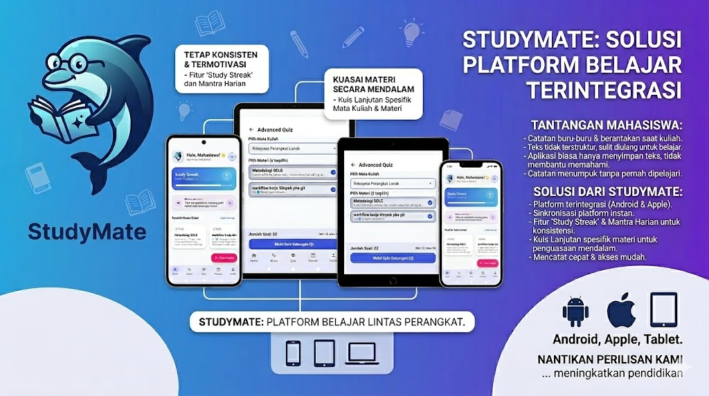
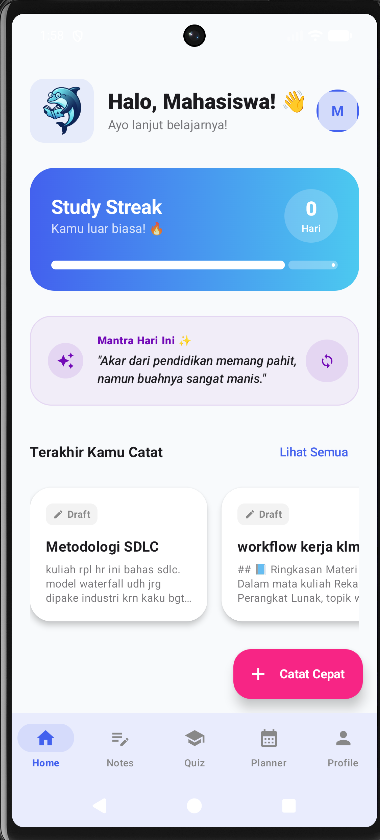
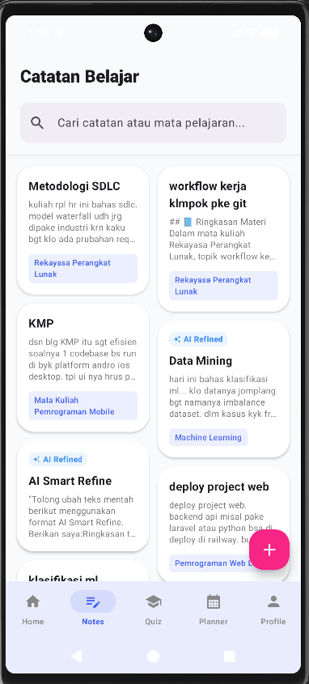
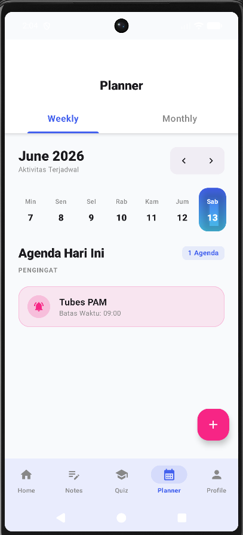
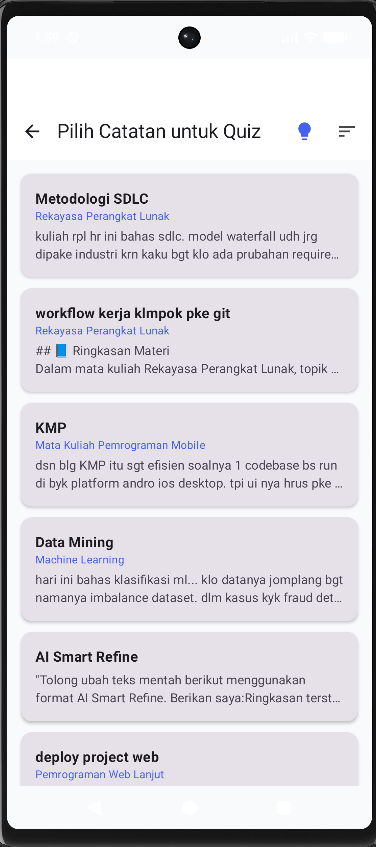
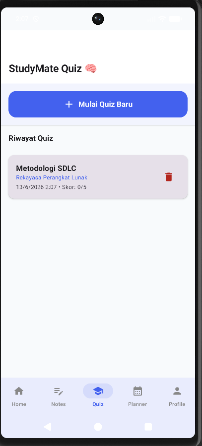
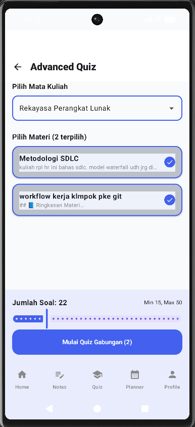
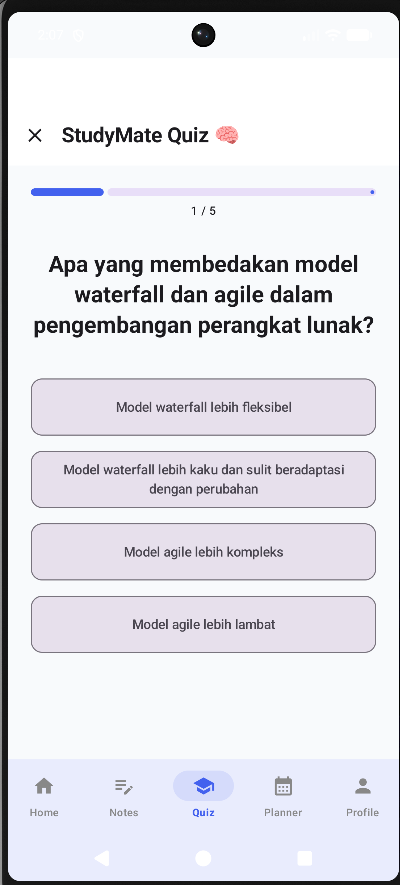
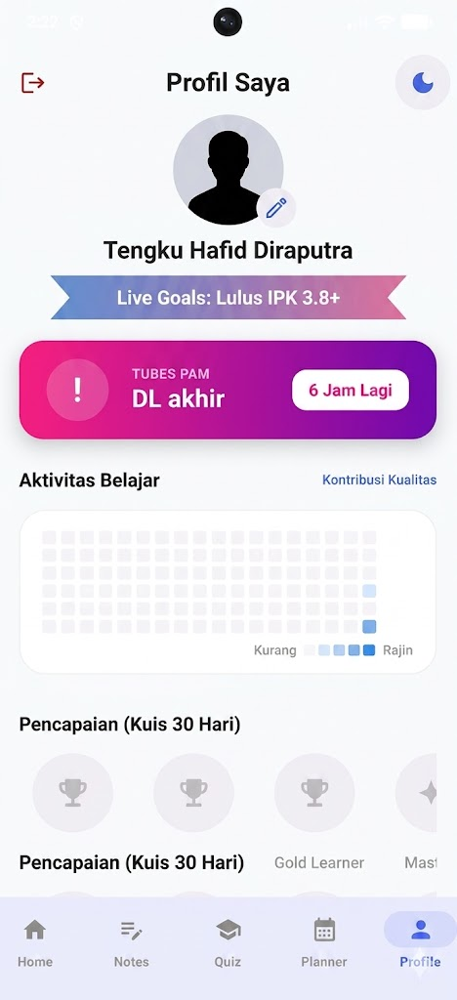

# 🐬 StudyMate — AI-Powered Smart Note & Learning Companion


> Aplikasi mobile multiplatform yang menjembatani celah antara **"mencatat"** dan **"memahami"** — memanfaatkan **AI Groq (LLaMA 3.3)** untuk mengubah catatan kuliah yang berantakan menjadi materi belajar terstruktur dan interaktif.

**Tugas Besar — IF25-22017 Pengembangan Aplikasi Mobile**
Program Studi Teknik Informatika, Institut Teknologi Sumatera (ITERA)
Tahun Akademik Genap 2025/2026

---

## 🎥 Demo Video

 --- [](https://s.itera.id/TubesPAM-StudyMate) ---
---

## 📱 Screenshots

Berikut adalah tampilan antarmuka aplikasi StudyMate pada berbagai fitur utama.

### 🖼️ Banner Aplikasi

<p align="center">
  
</p>

> Poster promosi utama yang merangkum fitur-fitur unggulan dan solusi yang ditawarkan oleh StudyMate — dari Smart Notes hingga AI Quiz.

---

### 🏠 Alur Utama

| Beranda | Smart Notes | Planner |
|:---:|:---:|:---:|
|  |  |  |
| Halaman utama menampilkan **Study Streak**, mantra harian, dan akses cepat ke catatan terakhir. | Direktori catatan per mata kuliah — tampilkan status **Draft** atau **AI Refined** untuk setiap catatan. | Kalender bulanan/mingguan beserta daftar **deadline tugas dan ujian** yang bisa diatur pengingat-nya. |

---

### 🤖 Fitur AI Quiz

| Pilih Catatan untuk Kuis | Dasbor Kuis | Kuis Gabungan | Pengerjaan Soal |
|:---:|:---:|:---:|:---:|
|  |  |  |  |
| Pilih satu catatan spesifik yang ingin diubah menjadi soal evaluasi oleh AI. | Tampilkan tombol mulai kuis baru dan **riwayat kuis** sebelumnya beserta skor. | Buat kuis dari **beberapa catatan sekaligus** dan atur jumlah soal yang diinginkan. | Antarmuka pengerjaan soal pilihan ganda yang di-*generate* otomatis oleh **Gemini AI**. |

---

### 👤 Profil Pengguna

<p align="center">
  
</p>

> Dasbor profil lengkap — menampilkan identitas pengguna, **Live Goals** (target pencapaian), **Learning Heatmap** aktivitas belajar harian, dan lencana trofi pencapaian.

---

### ✨ Fitur Lainnya

Fitur-fitur berikut tersedia di dalam aplikasi dan akan dilengkapi screenshot pada rilis final:

| Fitur | Deskripsi |
|-------|-----------|
| **AI Smart Refine** | Masukkan catatan mentah, lalu AI akan otomatis merapikan struktur, menambahkan *bullet points*, dan membuat glosarium istilah teknis. |
| **Streak Tracker** | Visualisasi konsistensi belajar harian — pengguna didorong untuk mencatat minimal satu materi setiap hari agar streak tidak terputus. |
| **Dark Mode** | Dukungan tema gelap/terang berbasis Material 3, tersimpan otomatis lewat DataStore sehingga pilihan tema diingat antar sesi. |
| **Learning Heatmap** | Grafik frekuensi belajar bergaya *contribution graph* GitHub — semakin sering belajar, semakin pekat warna kotaknya. |
| **Smart Reminder** | Notifikasi cerdas yang muncul beberapa hari sebelum ujian atau deadline, mengingatkan pengguna untuk melakukan sesi review. |
| **Offline Access** | Seluruh catatan tersimpan lokal via SQLDelight — dapat dibaca dan diedit tanpa koneksi internet; fitur AI terdegradasi dengan pesan informatif. |

---

## 👥 Tim Pengembang

| Role | Nama | NIM | GitHub |
|------|------|-----|--------|
| Lead Developer & Android Dev | Tengku Hafid Diraputra | `123140043` | [@ThDptr](https://github.com/ThDptr) |
| Full-stack Developer & QA | Joyapul Hanscalvin Panjaitan | `119140157` | [@joyapul119140157](https://github.com/joyapul119140157) |

**Dosen Pengampu:** Pak Habib — [@mh4Scripts](https://github.com/mh4Scripts)

---

## 📖 Deskripsi Project

### Masalah yang Diselesaikan

Mahasiswa sering mencatat dengan terburu-buru saat kuliah, menghasilkan teks yang berantakan, tidak terstruktur, dan sulit diulang untuk belajar. Aplikasi catatan biasa hanya menyimpan teks tanpa membantu proses memahaminya. Akibatnya, catatan menumpuk tanpa pernah benar-benar dipelajari.

### Solusi StudyMate

StudyMate bekerja dalam **satu siklus pembelajaran yang utuh** — dari input mentah hingga pengujian pemahaman:

1. **Capture** — Masukkan catatan cepat saat kuliah berlangsung, fokus pada kecepatan, bukan kerapian
2. **Refine** — AI Groq memproses teks: memperbaiki struktur, menambah konteks, dan menjelaskan istilah teknis
3. **Consistency** — Sistem Streaks memotivasi pengguna untuk mencatat minimal satu materi setiap hari
4. **Recall** — Catatan yang telah dirapikan diolah menjadi kuis otomatis untuk menguji pemahaman

### Target Pengguna

Mahasiswa dan pelajar yang ingin mencatat lebih efektif dan mengubah catatan mentah mereka menjadi sesi belajar aktif yang terstruktur.

---

## ✨ Fitur

### 🟢 Core Features (Sprint 1–2, Wajib)

- [ ] **Onboarding & Profil Pengguna** — Input nama dan NIM; data disimpan lokal dengan SQLDelight
- [ ] **Smart Notes** — Manajemen catatan per mata pelajaran dengan folder terorganisir
- [ ] **AI Smart Refine** — Perbaikan otomatis teks berantakan: struktur, bullet points, dan glosarium istilah teknis via Groq API
- [ ] **Offline Access** — Catatan tersimpan lokal via SQLDelight, dapat diakses tanpa internet
- [ ] **AI Quiz** — Generate soal pilihan ganda dan flashcard otomatis dari catatan pengguna
- [ ] **Streak Tracker** — Visualisasi konsistensi belajar harian
- [ ] **Kalender & Planner** — Pencatatan jadwal ujian dan tenggat waktu tugas
- [ ] **Navigasi Multi-Screen** — 5 layar utama: Beranda, Catatan, Belajar, Kalender, Profil
- [ ] **State Management** — MVVM + StateFlow untuk semua UI state
- [ ] **CI/CD Pipeline** — GitHub Actions untuk automated build pada setiap push/PR

### 🟡 Pro Upgrades (Sprint 3, Target Bintang 5)

- [ ] **Dark Mode** — Support tema gelap/terang dengan Material 3, persisted via DataStore
- [ ] **Learning Heatmap** — Visualisasi frekuensi belajar mirip contribution graph GitHub
- [ ] **Smart Reminder** — Notifikasi cerdas beberapa hari sebelum ujian untuk sesi review
- [ ] **Animations** — Transisi antar screen, loading saat proses AI, indikator progress

### 🟣 Polish, Testing & Final (Sprint 4–5)

- [ ] **Comprehensive Test Suite** — Minimal 10 unit test + 3 UI test (Compose UI Test) + code coverage via Kover (target 50%+, bonus 70%+)
- [ ] **Bug Fixes & Null-Safety** — Penghapusan operator force-unwrap (`!!`), smart-cast aman
- [ ] **Design Token Centralization** — Sistem `Spacing` terpusat untuk konsistensi layout
- [ ] **Snackbar Feedback** — Popup konfirmasi pada setiap aksi Simpan / Buat / Ubah / Hapus
- [ ] **Final Demo & Release APK** — Build release dengan signing + versioning

### 🔵 Stretch Goals (Opsional)
- [ ] **Export Catatan ke PDF** — Export catatan yang sudah di-refine untuk backup eksternal
- [ ] **Collaborative Notes** — Berbagi catatan antar pengguna dalam satu mata pelajaran

---

## 🛠️ Tech Stack

| Kategori | Teknologi | Versi |
|----------|-----------|-------|
| **Framework** | Kotlin Multiplatform + Compose Multiplatform | 2.0.21 / 1.7.0 |
| **Architecture** | Clean Architecture + MVVM | — |
| **State Management** | StateFlow + Sealed Class UI State | — |
| **Navigation** | Compose Navigation (Type-safe) | 2.8.x |
| **Async** | Coroutines + Flow | 1.9.0 |
| **Networking** | Ktor Client | 3.0.x |
| **Local Storage** | SQLDelight | 2.0.2 |
| **Preferences** | DataStore | 1.1.x |
| **Dependency Injection** | Koin | 4.0.0 |
| **AI Provider** | Groq API (`llama-3.3-70b-versatile`) | Free Tier |
| **Serialization** | Kotlinx Serialization JSON | 1.7.x |
| **Testing** | kotlin.test + MockK + Turbine | — |
| **Code Coverage** | Kover | 0.9.x |
| **CI/CD** | GitHub Actions | — |
| **Build Tool** | Gradle (Kotlin DSL) | 8.x |

---

## 🏗️ Arsitektur

StudyMate mengadopsi **Clean Architecture** dengan tiga layer terpisah, mengikuti prinsip Dependency Rule (dependencies point inward).

```
┌─────────────────────────────────────────────────────────────┐
│                    PRESENTATION LAYER                        │
│   Composables (Screens) ◄──► ViewModels (StateFlow)          │
│   - HomeScreen           - HomeViewModel                     │
│   - NotesScreen          - NotesViewModel                    │
│   - QuizScreen           - QuizViewModel                     │
│   - CalendarScreen       - CalendarViewModel                 │
│   - ProfileScreen        - ProfileViewModel                  │
└───────────────────────────┬─────────────────────────────────┘
                            │ depends on ▼
┌───────────────────────────┴─────────────────────────────────┐
│                      DOMAIN LAYER (Pure Kotlin)              │
│   - Models: Note, Quiz, UserProfile, Streak, CalendarEvent   │
│   - Use Cases:                                               │
│     · RefineNoteUseCase (AI Groq)                            │
│     · GenerateQuizUseCase (AI Groq)                          │
│     · GetStreakUseCase                                       │
│     · GetCalendarEventsUseCase                               │
│   - Interfaces: NoteRepository, QuizRepository,              │
│     UserRepository, CalendarRepository                       │
└───────────────────────────┬─────────────────────────────────┘
                            │ implemented by ▼
┌───────────────────────────┴─────────────────────────────────┐
│                       DATA LAYER                             │
│   - Repository Implementations                               │
│   - Local Data Source: SQLDelight (notes, profile, streak)   │
│   - Remote Data Source: Ktor + Groq API                      │
│   - Preferences: DataStore (tema, onboarding flag)           │
│   - DTOs: GroqRequestDto, GroqResponseDto                    │
│   - Mappers: DTO ↔ Domain Model                              │
└─────────────────────────────────────────────────────────────┘
```

---

## 📁 Struktur Folder

```
composeApp/src/
├── commonMain/kotlin/com/studymate/
│   ├── core/                      # Core utilities (cross-cutting)
│   │   ├── di/                    # Koin modules (AppModule, DataModule, ...)
│   │   ├── network/               # Ktor config, HttpClientFactory
│   │   └── util/                  # Extensions, DatabaseDriverFactory, helpers
│   │
│   ├── data/                      # 📦 DATA LAYER
│   │   ├── local/
│   │   │   ├── dao/               # SQLDelight DAOs (Note, UserProfile, Streak)
│   │   │   ├── entity/            # Database entities
│   │   │   └── datastore/         # DataStore preferences (tema, onboarding flag)
│   │   ├── remote/
│   │   │   ├── api/               # GroqService (Ktor client)
│   │   │   └── dto/               # Request/Response DTOs
│   │   └── repository/            # Repository implementations
│   │
│   ├── domain/                    # 🧠 DOMAIN LAYER (pure Kotlin)
│   │   ├── model/                 # Note, Quiz, UserProfile, Streak, CalendarEvent
│   │   ├── repository/            # Repository interfaces
│   │   └── usecase/               # Business logic use cases
│   │
│   └── presentation/              # 🎨 PRESENTATION LAYER
│       ├── navigation/            # NavHost, Routes, BottomNav
│       ├── theme/                 # Material 3 theme + Spacing tokens
│       ├── components/            # Reusable composables (StreakCard, HeatmapView, QuizCard)
│       └── screens/               # Feature screens + ViewModels
│           ├── home/              # Home dashboard (streak, mantra, quick snippets)
│           ├── notes/             # Smart Notes + AI Refine
│           ├── quiz/              # AI Quiz & progress tracking
│           ├── calendar/          # Planner & Smart Reminder
│           └── profile/           # Profil, heatmap, tema
│
├── commonMain/sqldelight/         # SQLDelight schema (.sq files)
├── commonMain/composeResources/   # Fonts, drawables, icons
├── androidMain/kotlin/            # Android actual (DB driver, DataStore)
└── iosMain/kotlin/                # iOS actual: DB driver + DataStore stub
```

---

## 🗓️ Project Plan & Sprint Breakdown

### 📊 Sprint Summary

| Sprint | Minggu | Fokus | Status |
|--------|--------|-------|--------|
| **Sprint 1** | W11 | Foundation: Setup, Architecture, CI/CD, README | ✅ Done |
| **Sprint 2** | W12 | Core Features: Profil, Navigasi, AI Integration, Smart Notes | 🔄 In Progress |
| **Sprint 3** | W13 | Advanced Features: AI Quiz, Streak Tracker, Kalender | 🔜 Planned |
| **Sprint 4** | W14 | Polish & Testing: Bug fixes, Unit/UI tests, Kover coverage, Dark Mode | 🔜 Planned |
| **Sprint 5** | W15 | Final Preparation: Notifikasi, Heatmap, Demo prep, Release APK | 🔜 Planned |
| **UAS** | W16 | Final Demo Day | 🔜 Planned |

### 📌 Sprint 1: Foundation (Minggu 11)

**Goal:** Aplikasi memiliki struktur Clean Architecture yang solid dan CI/CD berjalan.

| Task | PIC | Status |
|------|-----|--------|
| Repository setup di GitHub, invite kolaborator | 123140043 | ✅ Done |
| KMP project structure dengan Clean Architecture folders | 123140043 | ✅ Done |
| Konfigurasi Gradle, dependencies, Koin DI setup | 123140043 | ✅ Done |
| GitHub Actions CI workflow (build + APK artifact) | 119140157 | ✅ Done |
| SQLDelight schema: `notes`, `user_profile`, `streaks`, `calendar_events` | 123140043 | ✅ Done |
| Domain models: `Note`, `Quiz`, `UserProfile`, `Streak`, `CalendarEvent` | 123140043 | ✅ Done |
| Navigation skeleton untuk 5 screens | 119140157 | ✅ Done |
| README lengkap | 123140043 | ✅ Done |

**Deliverables Sprint 1:**
- ✅ GitHub repository dengan semua collaborator
- ✅ KMP project structure dengan Clean Architecture folders
- ✅ GitHub Actions CI passing
- ✅ README lengkap dengan team info, deskripsi, fitur, tech stack, arsitektur
- ✅ Project plan dengan task assignment

### 📌 Sprint 2: Core Features (Minggu 12)

**Goal:** End-to-end flow jalan: input catatan → AI refine → simpan lokal → tampil di layar.

| Task | PIC | Estimasi |
|------|-----|----------|
| Onboarding screen + input Nama/NIM (SQLDelight) | 123140043 | 4 jam |
| Home Screen UI (streak card, mantra, quick snippets) | 119140157 | 6 jam |
| Groq API integration via Ktor + JSON parsing | 123140043 | 8 jam |
| `RefineNoteUseCase` dengan prompt engineering | 123140043 | 4 jam |
| Smart Notes Screen UI + ViewModel (CRUD catatan) | 119140157 | 6 jam |
| AI Smart Refine flow (input teks → Groq → output terstruktur) | 123140043 | 4 jam |
| Folder/kategorisasi per mata pelajaran | 119140157 | 4 jam |
| Integration testing | Bersama | 4 jam |

**Deliverables Sprint 2:**
- AI Smart Refine berjalan end-to-end
- CRUD catatan dengan SQLDelight
- Home Screen reaktif dengan data lokal
- Navigasi 5 tab berfungsi

### 📌 Sprint 3: Advanced Features (Minggu 13)

**Goal:** Fitur belajar aktif dan konsistensi selesai — Quiz, Streak, dan Kalender.

| Task | PIC | Estimasi |
|------|-----|----------|
| `GenerateQuizUseCase` dengan prompt multi-format (PG + flashcard) | 123140043 | 6 jam |
| Quiz Screen UI + ViewModel (pilihan ganda, progress tracking) | 119140157 | 8 jam |
| Streak Tracker logic + SQLDelight persistence | 123140043 | 4 jam |
| Calendar Screen UI + event CRUD (ujian, tugas) | 119140157 | 6 jam |
| Smart Reminder (notifikasi sebelum ujian via WorkManager) | 123140043 | 6 jam |
| Dark Mode — Material 3 theme, persisted di DataStore | 119140157 | 4 jam |

**Deliverables Sprint 3:**
- AI Quiz berjalan end-to-end dari catatan yang sudah di-refine
- Streak Tracker terupdate otomatis saat user membuat/mengedit catatan
- Kalender menyimpan event dan menampilkan reminder
- Dark Mode toggle berfungsi di seluruh app

### 📌 Sprint 4: Polish & Testing (Minggu 14)

**Goal:** Stabilkan aplikasi, hilangkan bug, dan bangun test suite untuk rubrik kualitas kode.

**Rubrik Sprint 4:** Bug Fixes (25%) · UI Polish (25%) · Unit Tests (25%) · UI Tests (15%) · Coverage (10%, bonus 70%+).

| Task | PIC | Estimasi |
|------|-----|----------|
| Penghapusan seluruh operator force-unwrap (`!!`) | 123140043 | 4 jam |
| Design token `Spacing` terpusat (xs–xl dp) | 119140157 | 2 jam |
| Unit tests domain (Use Cases, repository in-memory) | 123140043 | 8 jam |
| Unit tests ViewModel (StateFlow + Turbine) | 119140157 | 6 jam |
| UI tests Compose (minimal 3 critical flows) | 119140157 | 4 jam |
| Kover code coverage setup + laporan | 123140043 | 2 jam |
| Learning Heatmap (Compose Canvas, mirip GitHub graph) | 119140157 | 6 jam |
| Snackbar feedback pada setiap aksi CRUD | 123140043 | 2 jam |

### 📌 Sprint 5: Final Preparation (Minggu 15)

**Goal:** Fitur penutup, persiapan demo, dan rilis APK.

| Task | PIC | Estimasi |
|------|-----|----------|
| Animasi transisi screen + loading AI indicator | 119140157 | 4 jam |
| Final bug fixes & regression testing | Bersama | 4 jam |
| Demo script + outline presentasi (3 menit) | Bersama | 2 jam |
| Finalisasi README + screenshots final | 123140043 | 2 jam |
| Build Release APK (signing + versioning) | 123140043 | 2 jam |

### 🛡️ Risk Mitigation

| Risiko | Probabilitas | Mitigasi |
|--------|--------------|----------|
| Groq API rate limit kena saat development | Medium | Masing-masing anggota pakai API key sendiri, mock response saat dev |
| Scope fitur terlalu besar untuk timeline | Medium | Drop fitur stretch goal dulu, prioritaskan core + satu bonus |
| Parsing output AI tidak konsisten | Medium | Prompt engineering ketat dengan contoh output JSON, retry logic |
| Sprint telat → sprint berikutnya ketat | Medium | Drop fitur non-kritis, prioritaskan core |
| Anggota tim sibuk/berhalangan | Low | Pair programming saat fitur kritis, commit message yang jelas |

---

## 🚀 Getting Started

### Prerequisites

- **Android Studio** Ladybug (2024.2.1) atau lebih baru — *atau* **IntelliJ IDEA** dengan plugin Kotlin Multiplatform
- **JDK 17+** (Temurin recommended)
- **Android SDK** dengan API level 24+
- **Groq API Key** — gratis di [console.groq.com](https://console.groq.com/)

### Installation

1. **Clone repository**

   ```bash
   git clone https://github.com/joyapul119140157/Proyek-Pengembangan-Aplikasi-Mobile.git
   cd Proyek-Pengembangan-Aplikasi-Mobile
   ```

2. **Setup `local.properties`**

   ```bash
   cp local.properties.example local.properties
   ```

   Lalu edit `local.properties` dan isi:

   ```properties
   GROQ_API_KEY=your_api_key_here
   sdk.dir=/path/to/Android/Sdk
   ```

3. **Sync & Build**

   ```bash
   ./gradlew build
   # atau lebih cepat (Windows PowerShell pakai .\gradlew):
   ./gradlew :composeApp:assembleDebug
   ```

4. **Run di Android**

   - Buka project di Android Studio / IntelliJ IDEA
   - Pilih run configuration `composeApp`
   - Pilih emulator/device → Run
   - Atau via CLI:
     ```bash
     ./gradlew :composeApp:installDebug
     ```

### Cara Mendapatkan Groq API Key (Gratis)

1. Buka [console.groq.com](https://console.groq.com/)
2. Sign in atau daftar dengan Google/GitHub account
3. Buka menu **API Keys** → **Create API Key**
4. Salin key dan paste ke `local.properties`
5. **Free tier:** kuota generous untuk development & demo

> ⚠️ **Jangan commit `local.properties` ke Git!** File ini sudah ada di `.gitignore`.

---

## 📦 Build Release APK

```bash
# 1. Generate keystore (sekali saja)
keytool -genkey -v -keystore studymate-release.jks -keyalg RSA \
  -keysize 2048 -validity 10000 -alias studymate

# 2. Build release APK (kredensial keystore di local.properties / env, JANGAN di-commit)
./gradlew :composeApp:assembleRelease
# Output: composeApp/build/outputs/apk/release/composeApp-release.apk
```

**Versioning (Semantic Versioning `MAJOR.MINOR.PATCH`)** diatur di `composeApp/build.gradle.kts`:

```kotlin
defaultConfig {
    versionCode = 1
    versionName = "1.0.0"
}
```

> ⚠️ **JANGAN commit password keystore ke Git.** Gunakan `local.properties` atau environment variable.

---

## 🔌 API Documentation

StudyMate mengintegrasikan **Groq API** dengan model LLaMA 3.3 untuk dua fitur utama: AI Smart Refine dan AI Quiz Generation.

### Endpoint

| Item | Nilai |
|------|-------|
| **Base URL** | `https://api.groq.com/openai/v1/` |
| **Model** | `llama-3.3-70b-versatile` |
| **Full endpoint** | `/openai/v1/chat/completions` |
| **Method** | `POST` |
| **Auth** | Bearer token via header `Authorization: Bearer <GROQ_API_KEY>` |
| **Content-Type** | `application/json` |
| **Client** | Ktor dengan `ContentNegotiation` (kotlinx-serialization) + `HttpTimeout` |

### API Key Flow

```
local.properties (GROQ_API_KEY=...)
   └─► build.gradle.kts (baca via Properties, inject ke BuildConfig)
        └─► ApiConfig (expect/actual) expose key ke commonMain
             └─► GroqService (Ktor) attach key sebagai Bearer header
```

Key **tidak pernah di-hardcode** di source — hanya dari `local.properties` (gitignored).

### Request Format

```json
{
  "model": "llama-3.3-70b-versatile",
  "messages": [
    { "role": "system", "content": "<system prompt>" },
    { "role": "user", "content": "<catatan mentah pengguna>" }
  ],
  "temperature": 0.7,
  "max_tokens": 2048
}
```

### Dua Use Case

| Use Case | Output | Keterangan |
|----------|--------|------------|
| **Smart Refine** | Teks terstruktur (Markdown) | Perbaiki struktur, bullet points, dan glosarium istilah teknis |
| **AI Quiz** | JSON terstruktur (array soal PG/flashcard) | Di-parse ke `QuizDto` lalu di-map ke domain model |

### Error Handling

`GroqService` memetakan error ke pesan Bahasa Indonesia yang user-friendly:

| Kondisi | Pesan ke User |
|---------|---------------|
| Network exception (no internet) | "Koneksi gagal. Pastikan internet Anda menyala dan coba lagi." |
| HTTP 400 | "Permintaan tidak valid. Catatan mungkin terlalu panjang atau mengandung konten tidak diizinkan." |
| HTTP 401 / 403 | "API key tidak valid atau sudah expired. Hubungi developer." |
| HTTP 429 | "Rate limit tercapai. Tunggu beberapa menit lalu coba lagi." |
| HTTP 500 / 502 / 503 | "Server AI sedang bermasalah. Coba lagi nanti." |

Saat offline, catatan tetap dapat dibaca dari SQLDelight — AI features terdegradasi dengan pesan informatif (graceful degradation).

---

## 🧪 Testing

```bash
# Run semua test (common + android)
./gradlew allTests

# Run unit test Android saja (lebih cepat)
./gradlew :composeApp:testDebugUnitTest

# Run UI test (butuh device/emulator)
./gradlew :composeApp:connectedDebugAndroidTest

# Generate laporan coverage (Kover)
./gradlew :composeApp:koverHtmlReport
# Laporan: composeApp/build/reports/kover/html/index.html
```

### Test Strategy

| Layer | Apa yang Ditest | Tools |
|-------|----------------|-------|
| Domain | Use Cases (RefineNote, GenerateQuiz, GetStreak) | kotlin.test |
| Data | Repository, Mappers, API parsing | kotlin.test + in-memory SQLDelight |
| Presentation | ViewModel state changes | Turbine (Flow testing) |
| UI | Critical user flows (refine, quiz, streak) | Compose UI Test |

**Target:** Minimal 10 unit test + 3 UI test · coverage 50%+ (bonus 70%+) diukur dengan Kover.

---

## 🎯 Mapping ke Pembelajaran Mata Kuliah

| Pertemuan | Topik | Penerapan di StudyMate |
|-----------|-------|------------------------|
| W1 | Setup Environment | KMP project setup, Gradle config |
| W2 | Kotlin Advanced | Coroutines untuk async AI call, Flow untuk reactive data, Sealed class untuk UI State |
| W3 | Compose Basics | Composables untuk semua screen, Material 3 theming |
| W4 | State & MVVM | StateFlow di setiap ViewModel, UDF pattern |
| W5 | Navigation | NavHost + type-safe routes antar 5 tab + sub-screens |
| W6 | Networking | Ktor Client untuk Groq API, JSON serialization |
| W7 | Local Storage | SQLDelight untuk catatan/profil/streak, DataStore untuk preferences |
| W8 | Platform Code | expect/actual untuk SQLDelight driver, notifikasi platform-specific |
| W9 | AI Integration | Groq LLaMA 3.3 untuk Smart Refine dan Quiz Generation |
| W10 | Testing & DI | Koin untuk DI, kotlin.test + Turbine + Kover untuk testing |

---

## 📚 Dokumentasi Tambahan

| Dokumen | Deskripsi |
|---------|-----------|
| [🚀 Cara Menjalankan](./docs/CARA_MENJALANKAN.md) | Panduan setup detail step-by-step |
| [🏗️ Struktur Kode](./docs/STRUKTUR_KODE.md) | Penjelasan arsitektur per folder |
| [🔧 Troubleshooting](./docs/TROUBLESHOOTING.md) | Solusi untuk masalah umum |
| [📋 Panduan Project](./docs/PANDUAN_PROJECT.md) | Detail penilaian dan timeline |

---

## ⚠️ Disclaimer

- Project ini dibuat untuk **tugas akhir mata kuliah** Pengembangan Aplikasi Mobile, bukan produk komersial.
- **Groq API** digunakan dengan free tier; tim tidak bertanggung jawab atas perubahan kebijakan dari Groq.
- Setiap baris kode original atau dengan attribution yang jelas. **Tidak ada plagiarisme** dari project lain.

---

## 📄 License

MIT License — bebas digunakan untuk pembelajaran.

---

## 🙏 Acknowledgements

- **Pak Habib** ([@mh4Scripts](https://github.com/mh4Scripts)) selaku dosen pengampu dan penyedia template starter
- **Groq** atas akses LLaMA 3.3 API free tier yang generous untuk development
- **JetBrains** atas Kotlin Multiplatform dan Compose Multiplatform

---

<p align="center">
  <strong>Made with ☕ and 📝 by Tim StudyMate</strong><br>
  <em>Institut Teknologi Sumatera — Teknik Informatika 2025/2026</em>
</p>