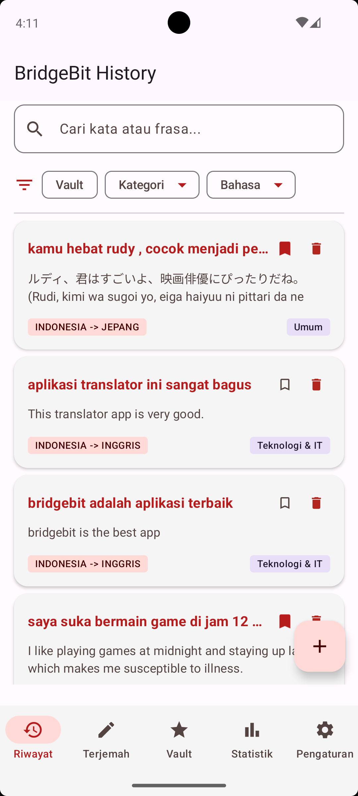
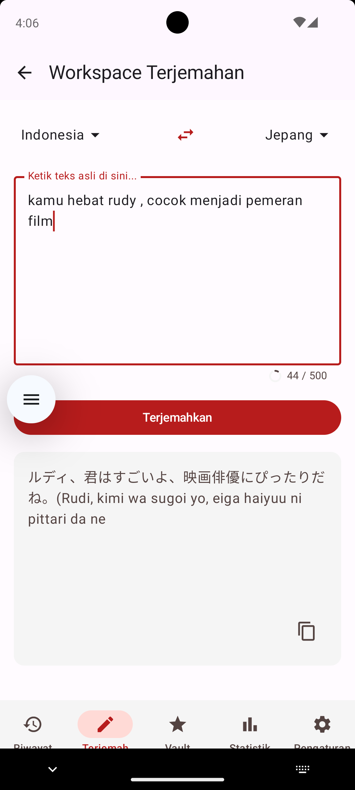
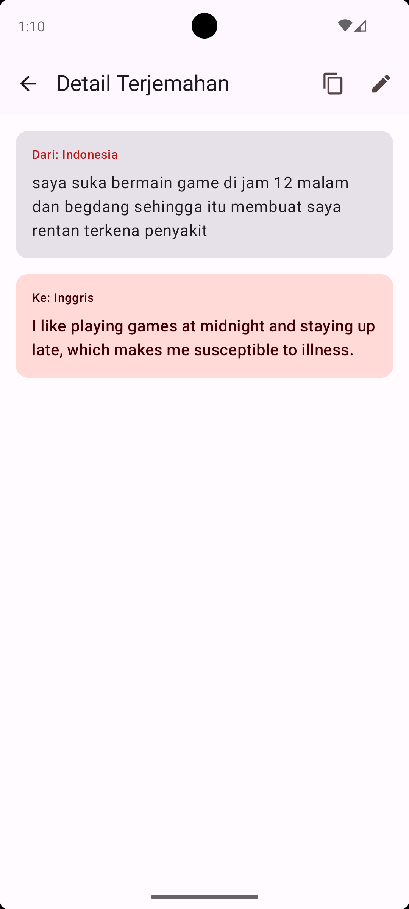
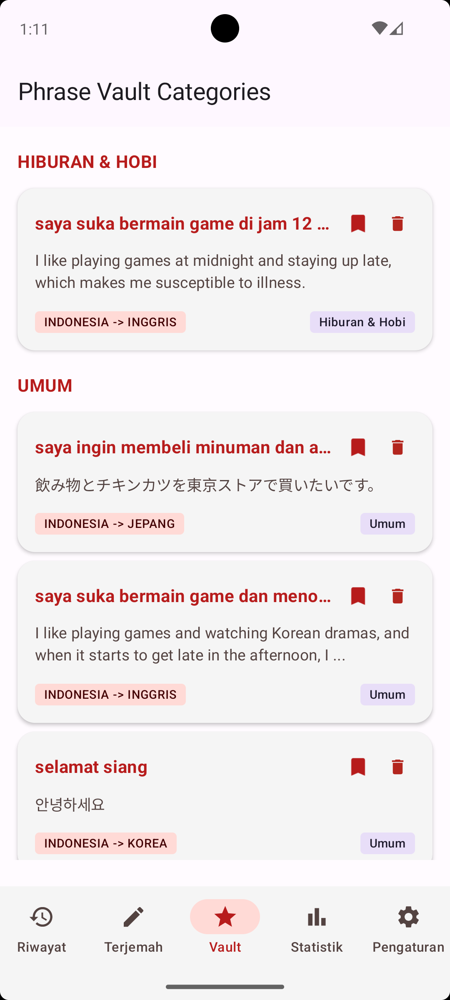
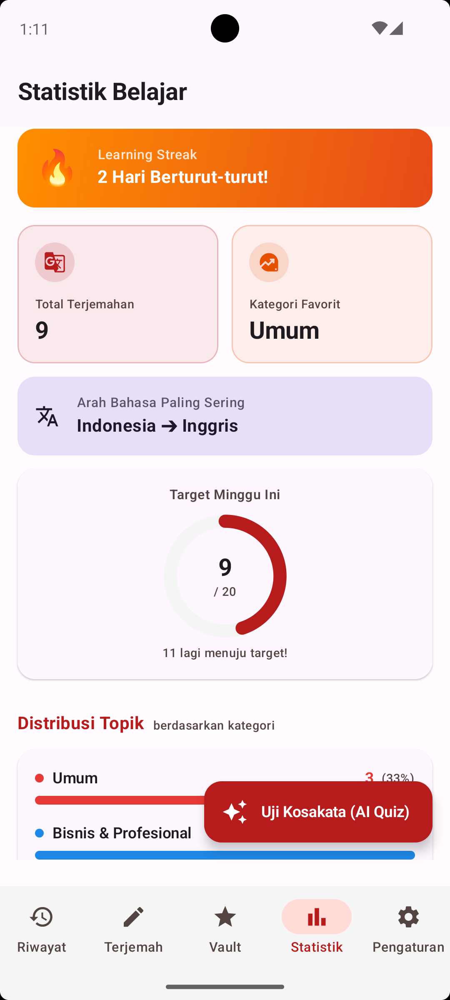
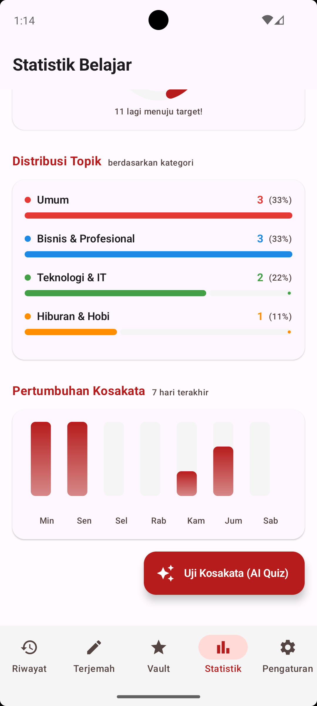
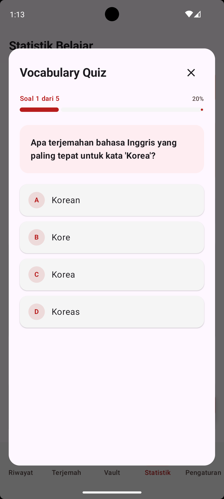

# BridgeBit

[](https://github.com/arrauf02/Proyek-Pengembangan-Aplikasi-Mobile/actions/workflows/ci.yml)

## 👥 Team

| Name | Role | GitHub |
| --- | --- | --- |
| Ar'rauf Setiawan Muhammad Jabar | Domain + Data layer, Database, API | [@arrauf02](https://github.com/arrauf02) |
| Muhammad Daffa Hakim Matondang | Presentation layer, UI/UX, Testing | [@dakim777](https://github.com/dakim777) |

---

## 📖 Description

BridgeBit adalah aplikasi penerjemah cerdas berbasis AI yang dirancang untuk memberikan terjemahan kontekstual dan mendalam. Menggunakan Kotlin Multiplatform (KMP), aplikasi ini tidak hanya berfungsi sebagai alat penerjemah, tetapi juga sebagai asisten belajar kosakata pribadi yang dilengkapi dengan analitik pembelajaran, penyortiran kategori otomatis, dan kuis adaptif bertenaga AI.

---

## 🎬 Demo

- **Link Demo Sprint 2:** https://youtube.com/shorts/ngfyzMd6CXk?feature=share
- **Video Tes Coverage dan UI Polish Test Sprint 4 PAM:** https://youtu.be/OUmG4H25QWI
- **Final Demo Sprint 5:** https://youtu.be/xQ9w_WuBjTE

---

## 📸 Screenshots & UI Previews

|                         Dashboard & History                         | Workspace (Translate) | Detail Terjemahan |
|:-------------------------------------------------------------------:| :---: | :---: |
|                                   |  |  |
| Menampilkan riwayat dengan fitur pencarian & filter multi-kriteria. | Input teks cerdas dengan deteksi kategori otomatis oleh Gemini AI. | Detail hasil terjemahan lengkap dengan opsi salin, edit, dan simpan. |

|                          Phrase Vault                           | Learning Insights |                            AI Vocabulary Quiz                             |
|:---------------------------------------------------------------:| :---: |:-------------------------------------------------------------------------:|
|                                | <br><br> |                                            |
| Kumpulan kosakata favorit yang dikelompokkan berdasarkan topik. | Statistik belajar, *Learning Streak*, grafik distribusi topik, dan pencapaian mingguan. | Kuis pilihan ganda yang dihasilkan otomatis oleh AI dari riwayat belajar. |

---

## ✨ Features

- [x] **AI-Powered Workspace (Terjemahan Cerdas):** Menerjemahkan teks antar bahasa dengan Gemini API. Termasuk fitur otomatisasi penambahan *romanisasi* (cara baca) untuk bahasa non-Latin (seperti Jepang, Korea, Arab) dan pengklasifikasian topik secara otomatis.
- [x] **Dashboard & Advanced Filtering:** Menampilkan riwayat terjemahan dengan kemampuan pencarian teks secara langsung (*real-time debounce*) dan penyaringan berdasarkan *Vault*, Kategori Topik, atau Bahasa.
- [x] **Phrase Vault:** Menyimpan terjemahan penting ke database SQLDelight lokal untuk akses luring, yang otomatis dikelompokkan berdasarkan kategorinya.
- [x] **Learning Insights & Analytics:** Melacak progres belajar pengguna, termasuk *Learning Streak* (hari berturut-turut), total terjemahan, grafik *Vocabulary Growth* 7 hari terakhir, dan diagram distribusi topik.
- [x] **AI-Generated Vocabulary Quiz:** Fitur kuis dinamis yang membaca riwayat/vault pengguna dan memerintahkan Gemini API (via *JSON Mode*) untuk menghasilkan soal kuis *multiple-choice* adaptif untuk menguji kosakata.
- [x] **Settings & User Preferences:** Konfigurasi Mode Gelap (*Dark Mode*), pengaturan notifikasi pengingat belajar (menggunakan izin notifikasi *native*), dan kontrol manajemen penghapusan data lokal.

---

## 📁 Struktur Project

```text
composeApp/src/
├── commonMain/
│   ├── kotlin/com/example/bridgebit/
│   │   ├── core/                      # Utilitas, Network (Ktor), Koin DI, & Notification
│   │   │   ├── di/                    # Modul Dependency Injection (AppModule, dll)
│   │   │   ├── network/               # Konfigurasi HTTP Client (Ktor) & ApiConfig
│   │   │   ├── notification/          # Abstraksi NotificationService (expect/actual)
│   │   │   └── util/                  # Ekstensi & expect/actual classes (Clipboard, Driver DB)
│   │   │
│   │   ├── data/                      # Data layer (Local, Remote, Repository Impl)
│   │   │   ├── local/                 # SQLDelight Entity Mappers & DataStore Preferences
│   │   │   ├── remote/                # DTOs & GeminiService API (JSON parsing)
│   │   │   └── repository/            # Implementasi TranslationRepository & AIRepository
│   │   │
│   │   ├── domain/                    # Domain layer (Kotlin murni)
│   │   │   ├── model/                 # Domain models (Translation, QuizQuestion)
│   │   │   ├── repository/            # Interfaces untuk Repositori
│   │   │   └── usecase/               # Logika Bisnis (SearchHistory, ToggleVault, dll)
│   │   │
│   │   ├── presentation/              # Presentation layer (UI & State)
│   │   │   ├── components/            # Komponen Reusable (ShimmerEffect, EmptyState, dll)
│   │   │   ├── navigation/            # Setup Navigasi (AppNavHost, Routes)
│   │   │   ├── screens/               # Compose Screens & ViewModels
│   │   │   │   ├── dashboard/         # Halaman Beranda & Riwayat Filter
│   │   │   │   ├── detail/            # Halaman Detail Terjemahan
│   │   │   │   ├── insights/          # Halaman Statistik, Grafik, & UI Kuis AI
│   │   │   │   ├── vault/             # Halaman Frasa Tersimpan
│   │   │   │   └── workspace/         # Halaman Input & Terjemahan Baru
│   │   │   ├── theme/                 # Material 3 Theme, Typography, Spacing
│   │   │   └── App.kt                 # Main Compose entry point & Bottom Navigation
│   │   │
│   └── sqldelight/com/example/bridgebit/data/local/
│       └── BridgeBit.sq               # Skema database relasional (SQLDelight)
│
├── commonTest/kotlin/                 # Pengujian Unit & State Validation (Logika Common)
│
├── androidMain/                       # Implementasi platform-spesifik Android
│   ├── AndroidManifest.xml
│   ├── res/                           # Resources Native Android (strings, launcher icons)
│   └── kotlin/com/example/bridgebit/
│       ├── MainActivity.kt            # Entry point UI Android
│       ├── NoteAIApplication.kt       # Application class & Lifecycle tracking
│       └── core/ & data/              # Implementasi `actual` (AndroidSqliteDriver, DataStore, Clipboard)
│
├── androidUnitTest/kotlin/            # Unit Test & UI Test (Kover, Robolectric, JUnit4)
│
└── iosMain/kotlin/                    # Implementasi platform-spesifik iOS
    ├── MainViewController.kt          # Compose UIViewController wrapper
    └── core/ & data/                  # Implementasi `actual` (NativeSqliteDriver, NSDocumentDirectory)
```

---

## 🛠 Tech Stack

| Kategori | Teknologi |
| --- | --- |
| **Framework** | Kotlin Multiplatform (KMP), Compose Multiplatform |
| **Architecture** | Clean Architecture + MVVM (Model-View-ViewModel) |
| **Dependency Injection** | Koin |
| **Networking** | Ktor HTTP Client (dengan *ContentNegotiation* & *Logging*) |
| **Database Lokal** | SQLDelight |
| **Preferences** | Jetpack DataStore |
| **Testing** | JUnit4, MockK, Coroutines Test, Compose UI Test (Robolectric) |
| **API** | Gemini API (`gemini-2.5-flash`) |

---

## 🧪 Testing & Coverage

Fokus pengujian dibagi ke dalam 3 *layer* utama:

### 1. Presentation Layer (UI & ViewModel)
- **Dashboard (`DashboardScreenTest`, `DashboardViewModelTest`):** Menguji fungsionalitas *Search Bar*, filter multi-kriteria (Vault, Kategori, Bahasa), *empty state*, serta logika *debounce* pada pencarian.
- **Workspace (`WorkspaceScreenTest`, `WorkspaceViewModelTest`):** Menguji interaksi *dropdown* bahasa, validasi tombol *translate*, *loading state*, dan logika integrasi Gemini AI serta pemanggilan fungsi simpan.
- **Vault (`VaultScreenTest`, `VaultViewModelTest`):** Memastikan frasa dikelompokkan (*grouping*) dengan benar berdasarkan kategori, menguji *empty state*, dan aksi tombol *Unvault* / Hapus.
- **Insights & AI Quiz (`InsightsScreenTest`, `InsightsViewModelTest`):** Menguji akurasi kalkulasi statistik (total, kategori favorit, distribusi topik) dan alur *AI Quiz* (mulai kuis, penanganan jawaban benar/salah, hingga perhitungan skor).
- **Detail (`TranslationDetailScreenTest`, `TranslationDetailViewModelTest`):** Menguji penanganan *Success* dan *Error state*, pengecekan label arah bahasa, serta ketersediaan tombol navigasi (Salin/Edit).

### 2. Domain Layer (Use Cases)
- **TranslationUseCases (`TranslationUseCasesTest`):** Menguji murni logika bisnis untuk fitur riwayat dan *vault* (seperti `SaveTranslation`, `SearchHistory`, `DeleteTranslation`, dll). Memastikan Use Case melempar status `Result.success` atau `Result.failure` secara akurat berdasarkan respon Repository.

### 3. Data Layer (Repository)
- **AIRepository (`AIRepositoryImplTest`):** Menguji interaksi dengan Gemini API menggunakan Ktor. Memastikan *prompting* berjalan sesuai *WritingStyle* (Formal/Casual) dan membersihkan/mem-parsing format respon AI dengan benar.
- **TranslationRepository (`TranslationRepositoryImplTest`):** Menguji pemetaan data (*mapping*) dari Domain Model ke SQLDelight Entity dan memvalidasi eksekusi *query* *database* (Insert, Update, Delete, Toggle).

### Kover Coverage Report

| Module / Package | Line Coverage |
| --- | --- |
| **Overall Project (`composeApp`)** | **83.6%** |
| `presentation.screens.dashboard` | 97.0% |
| `presentation.screens.insights` | 76.2% |
| `presentation.screens.vault` | 95.3% |
| `presentation.screens.workspace` | 97.8% |
| `presentation.screens.detail` | 94.9% |


*(Screenshot Kover HTML Report terbaru dapat dilihat di atas, atau diakses via `build/reports/kover/htmlDebug/index.html` setelah menjalankan task Kover).*


---

## 🚀 Setup & Installation

Ikuti langkah-langkah di bawah ini untuk menjalankan proyek BridgeBit di mesin lokal Anda.

### 1. Prasyarat Sistem

- Android Studio (Jellyfish / Koala atau terbaru) dengan plugin Kotlin Multiplatform terinstal.
- Xcode (untuk menjalankan/men-deploy aplikasi ke simulator atau perangkat iOS).
- JDK 17 atau yang lebih baru.

### 2. Kloning Repositori

```bash
git clone https://github.com/arrauf02/Proyek-Pengembangan-Aplikasi-Mobile.git
cd Proyek-Pengembangan-Aplikasi-Mobile
```

### 3. Dapatkan Gemini API Key

Aplikasi ini membutuhkan API key dari Google Gemini untuk fitur terjemahan dan pembuatan kuis.

1. Kunjungi [Google AI Studio](https://aistudio.google.com/).
2. Buat proyek baru dan dapatkan **API Key** Anda.

### 4. Konfigurasi API Key

Agar Ktor dapat melakukan *request* ke Gemini API, Anda wajib menyematkan API Key tersebut ke dalam platform Android dan iOS.

#### 🤖 Android

1. Buka file `local.properties` di *root directory* proyek (jika belum ada, buat file tersebut).
2. Tambahkan baris berikut:

```properties
GEMINI_API_KEY=YOUR_API_KEY_HERE
```

3. Lakukan **Sync Project with Gradle Files**. Variabel ini akan otomatis diinjeksi ke dalam `BuildConfig` via pengaturan Gradle.

#### 🍎 iOS

1. Buka folder `iosApp/iosApp/` di Finder atau Xcode.
2. Buka file `Info.plist`.
3. Tambahkan atribut kunci baru dengan nama `GEMINI_API_KEY` bertipe `String`, lalu masukkan API Key Anda sebagai *value*-nya:

```xml
<key>GEMINI_API_KEY</key>
<string>YOUR_API_KEY_HERE</string>
```

### 5. Menjalankan Aplikasi

**Android:**
Buka proyek di Android Studio, pilih modul `composeApp`, pilih emulator atau perangkat fisik, lalu klik **Run** (`Shift + F10`).

**iOS:**
Pilih konfigurasi target `iosApp` di Android Studio dan pilih Simulator iOS, atau buka folder `iosApp` menggunakan **Xcode**, tunggu dependensi *CocoaPods*/*SPM* terselesaikan, lalu klik **Play** (`Cmd + R`).

### 6. Menjalankan Unit Test & Coverage

Untuk mengeksekusi semua tes di Android dan melihat laporan *coverage*:

```bash
./gradlew koverHtmlReportDebug
```

Buka file berikut di browser untuk melihat laporan interaktif:

```
build/reports/kover/htmlDebug/index.html
```

---

## 📦 Release APK

Aplikasi BridgeBit sudah dapat digunakan dan file `.apk` telah tersedia untuk diunduh. Anda bisa mengakses file APK-nya melalui tautan Google Drive di bawah ini:

[Unduh BridgeBit APK](https://drive.google.com/drive/folders/1A72xfHPWw6eMLpoc5LTFzfRS3jDQmnro?usp=sharing)