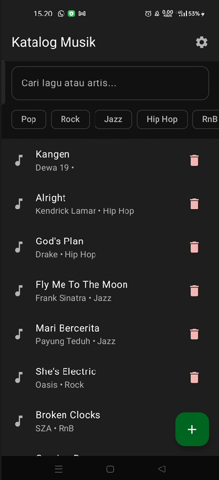
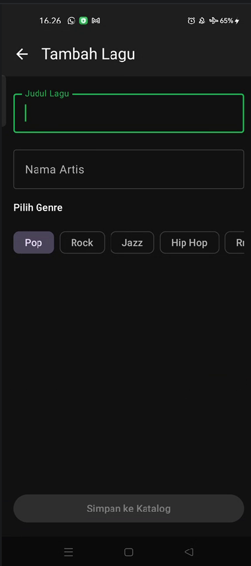
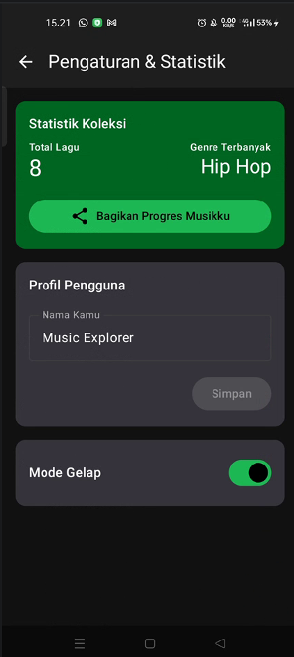

# 🎵 MusicKeep

## 👤 Team
- **Andre Prasetya Daely** (123140131) - [@andree050505](https://github.com/08-131-AndrePrasetyaDaely) 

## 📄 Description
MusicKeep adalah aplikasi katalog musik pribadi yang dirancang untuk membantu pengguna mengelola daftar lagu favorit mereka secara terorganisir. Aplikasi ini berfokus pada kemudahan input data musik dan penyajian informasi statistik koleksi secara offline, memberikan pengalaman pengguna yang mulus dalam mendokumentasikan perjalanan musik mereka.

## ✨ Features
- **Full CRUD Management**: Tambah, lihat, edit, dan hapus data musik dengan mudah.
- **Smart Search & Filtering**: Pencarian responsif dengan debounce logic dan filter berdasarkan genre musik.
- **Automatic Statistics**: Ringkasan otomatis total koleksi dan genre musik yang paling sering didengarkan.
- **User Profile & Theme**: Personalisasi nama pengguna dan dukungan penuh mode gelap (Dark Mode).
- **Offline First**: Penyimpanan data lokal yang handal menggunakan SQLDelight.

## 🛠️ Tech Stack
- **Framework**: Kotlin Multiplatform (KMP)
- **UI Framework**: Compose Multiplatform
- **Database**: SQLDelight
- **Local Storage**: DataStore Preferences
- **Dependency Injection**: Koin
- **Architecture**: Clean Architecture + MVVM

## 📐 Architecture
Aplikasi ini menggunakan **Clean Architecture** yang memisahkan kode menjadi tiga layer utama:
1. **Presentation Layer**: UI (Compose) dan ViewModels (State Management).
2. **Domain Layer**: Model data dan abstraksi repository.
3. **Data Layer**: Implementasi repository, pemetaan database, dan manajemen preferensi lokal.

## 🚀 Getting Started
1. Clone repository ini.
2. Buka project menggunakan Android Studio Ladybug (2024.2.1) atau versi terbaru.
3. Tunggu proses Gradle Sync selesai.
4. Hubungkan emulator atau device Android.
5. Klik tombol **Run 'composeApp'**.

## 🎬 Video Demo
[▶️ Tonton Video Demo MusicKeep](https://youtu.be/OIdjdCJ_aQM)

## 📦 Download APK
[⬇️ Download MusicKeep v1.0.0](https://github.com/08-131-AndrePrasetyaDaely/Proyek-Pengembangan-Aplikasi-Mobile/releases/latest)

## 📸 Screenshots

| [Daftar Katalog] | [Tambah Lagu] | [Statistik & Pengaturan] |
| :---: | :---: | :---: |
|  |  |  |

---
*Dikembangkan untuk Tugas Besar Mata Kuliah Pengembangan Aplikasi Mobile - ITERA*
