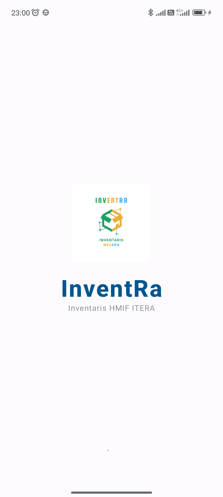
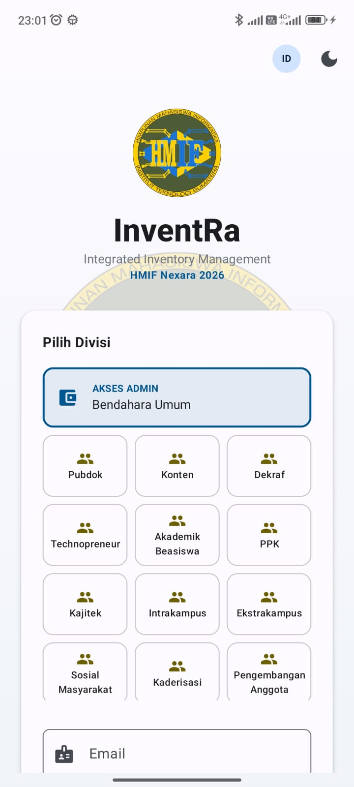
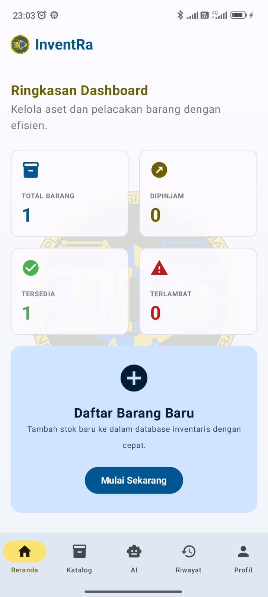
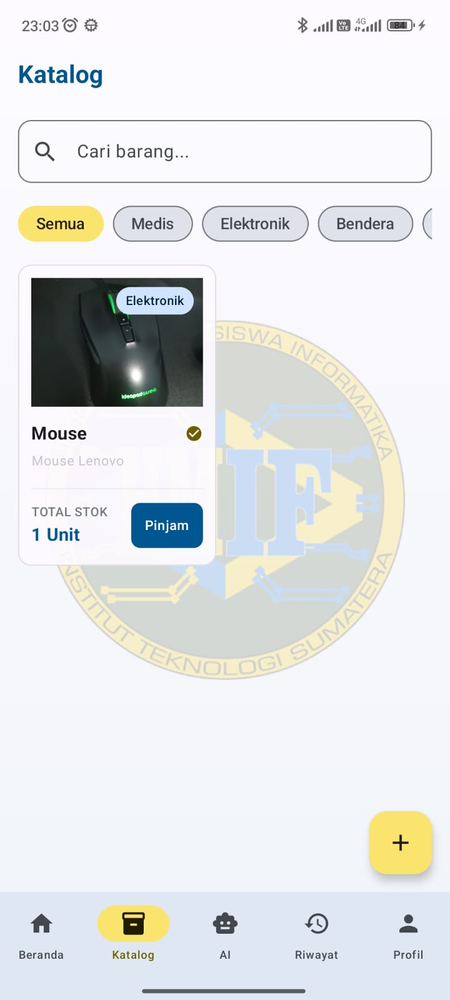
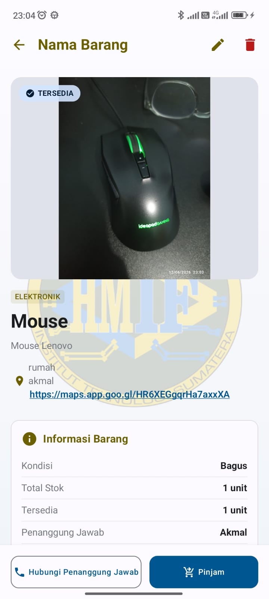
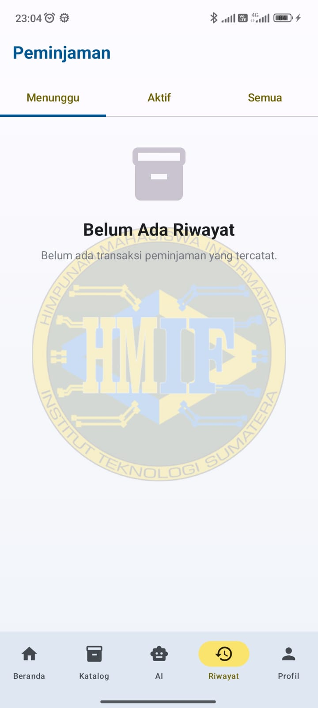
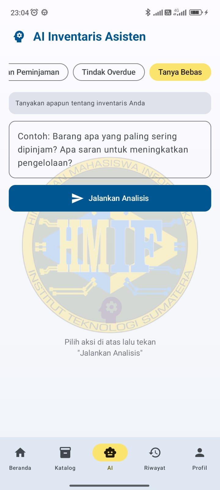
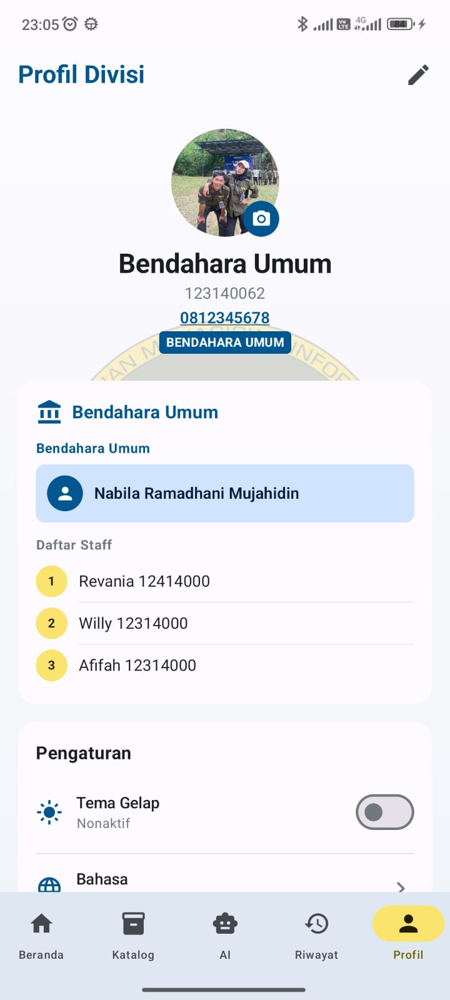
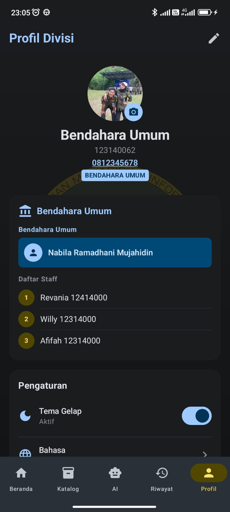

# 📦 InventRa — Digital Inventory Solution


**InventRa** adalah aplikasi manajemen inventaris cerdas yang dirancang khusus untuk pengurus **HMIF ITERA**. Aplikasi ini memungkinkan peminjaman dan pengembalian aset organisasi secara terorganisir dengan bantuan asisten AI, sinkronisasi cloud real-time, dan dukungan offline.

---

## 🏗️ Contributors

| Nama | GitHub | Role |
|------|--------|------|
| **Muhammad Naufal Fikri Akmal** | [@MNAUFALFAKMAL](https://github.com/MNAUFALFAKMAL) | **Lead Developer & System Architect** |
| **Nabila Ramadhani Mujahidin** | [@nblable](https://github.com/nblable) | **Full-Stack Developer & UI/UX Specialist** |

---

## 📸 Screenshots

| Splash | Login | Dashboard |
|:---:|:---:|:---:|
|  |  |  |

| Catalog | Item Detail | History |
|:---:|:---:|:---:|
|  |  |  |

| AI Assistant | Profile | Dark Mode |
|:---:|:---:|:---:|
|  |  |  |

---

## ✨ Fitur Utama

- 🤖 **AI Inventory Assistant** — Analisis stok dan bantuan cerdas via Google Gemini AI.
- 🔄 **Hybrid Data Sync** — Offline-first dengan SQLDelight & sinkronisasi otomatis ke Supabase.
- 🔐 **Multi-Role Access** — Pemisahan hak akses antara Admin (Bendahara) dan Member (Staff).
- 🌍 **Localization Ready** — Dukungan penuh Bahasa Indonesia dan Inggris.
- 🎨 **Premium UI/UX** — Material 3 dengan dukungan Dark Mode dan animasi transisi.

---

## 🏗️ Architecture Detail

Aplikasi ini mengimplementasikan **Clean Architecture** (Data, Domain, Presentation) untuk kode yang modular dan *testable*.

```
┌─────────────────────────────────────────────────────────┐
│                   PRESENTATION LAYER                    │
│  [Compose Multiplatform + ViewModel + StateFlow]        │
│  UI Logic, Screens, Navigation & Koin DI Modules        │
└──────────────────────┬──────────────────────────────────┘
                       │ Use Cases
┌──────────────────────▼──────────────────────────────────┐
│                    DOMAIN LAYER                         │
│  [Pure Kotlin]                                          │
│  Business Logic, Repository Interfaces & Domain Models  │
└──────────────────────┬──────────────────────────────────┘
                       │ Repository Impl
┌──────────────────────▼──────────────────────────────────┐
│                     DATA LAYER                          │
│  [SQLDelight ↔ Supabase ↔ Ktor ↔ Gemini]                │
│  Mappers, DTOs, & Local/Remote Data Sources             │
└─────────────────────────────────────────────────────────┘
```

---

## 🛠️ Tech Stack

| Layer | Technology | Keterangan |
|-------|------------|------------|
| **UI Framework** | Compose Multiplatform | Material 3, Dark Mode |
| **Navigation** | Navigation Compose | Type-safe + Transition Animations |
| **Networking** | Ktor Client | REST API & Gemini Integration |
| **Local DB** | SQLDelight | Offline Caching & Persistence |
| **Backend** | Supabase | Auth, PostgreSQL, Storage |
| **Preferences** | Jetpack DataStore | User Settings & Locale |
| **DI** | Koin | Dependency Injection |

---

## 📅 Project Journey (Sprint Logs)

| Sprint | Fokus | Status |
|--------|-------|:------:|
| **Sprint 1** | Foundation: Clean Arch, Koin DI, & SQLDelight Schema | ✅ |
| **Sprint 2** | Core: Supabase Auth, CRUD Barang, & Basic Navigation | ✅ |
| **Sprint 3** | Advanced: Offline Caching & Transition Animations | ✅ |
| **Sprint 4** | AI & Polish: Gemini AI Integration & Role-based Access | ✅ |
| **Sprint 5** | Final: Testing (40+ Units) & Release APK Stable | ✅ |

---

## 🧪 Testing & Quality Assurance

```bash
# Menjalankan Unit Tests (Repository & ViewModel)
./gradlew :composeApp:testDebugUnitTest

# Menjalankan UI Tests (Critical Flows)
./gradlew :composeApp:connectedDebugAndroidTest
```

**Status:** ✅ **65%+ Coverage achieved** (Repository & ViewModel logic fully covered).

---

## 🎥 Demo Video

| Phase | Link | QR Code |
|-------|------|:-------:|
| **Final Release** | [YouTube Video](https://s.itera.id/123140062-123140132-InventRa) |  |

---

*InventRa v1.0.0 — Solusi Inventaris Digital untuk HMIF ITERA*
