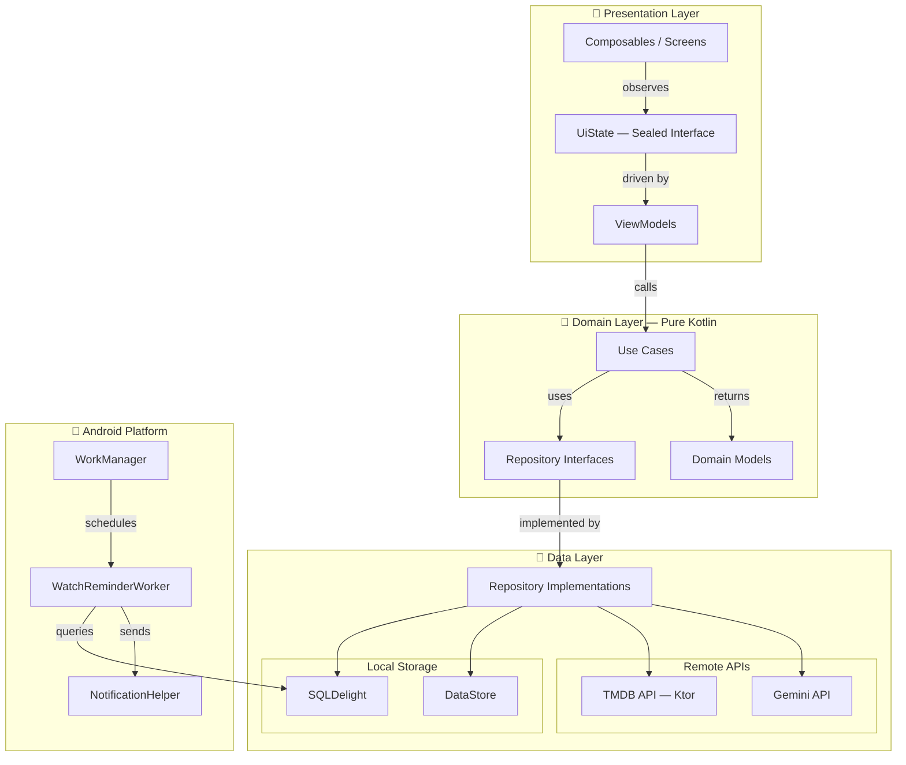

# 🎬 Rewind — Film & Series Personal Tracker


---

## 👥 Team

| Nama | GitHub                                             | NIM | Role |
|------|----------------------------------------------------|-----|------|
| Refi Ikhsanti | [@7refisa](https://github.com/7refisa)             | 123140126 | Domain Layer — Models, Repository Interfaces, Use Cases |
| Choirunnisa Syawaldina | [@choirunnisasy](https://github.com/choirunnisasy) | 123140136 | Data Layer — SQLDelight, Repository Impl, DI Modules |
| Keira Lakeisha Fachra Fuady | [@keiralakeisha](https://github.com/keiralakeisha) | 123140142 | Presentation Layer — Screens, ViewModels, Animations |

> 📚 **Mata Kuliah:** Pengembangan Aplikasi Mobile (IF25-22017) — Kelas RB  
> 🏫 **Institusi:** Program Studi Teknik Informatika, Institut Teknologi Sumatera (ITERA)  
> 👨‍🏫 **Dosen Pengampu:** Muhammad Habib Algifari, S.Kom., M.TI. ([@mh4Scripts](https://github.com/mh4Scripts))

---

## 📖 Description

**Rewind** adalah aplikasi mobile personal tracker untuk film dan series berbasis **Kotlin Multiplatform**. Pengguna bisa mencari film atau series dari TMDB, menambahkannya ke koleksi pribadi, mencatat status tontonan, memberi rating, dan menulis review. Dilengkapi **AI Assistant berbasis Google Gemini** yang membantu menulis review, merekomendasikan tontonan, dan fitur **notifikasi harian** untuk mengingatkan film yang sedang ditonton.

---

## 🌟 Features

### 📦 Core Features
- [x] **Search Film & Series** — Pencarian real-time terintegrasi TMDB API (search, trending, detail)
- [x] **Koleksi Pribadi (CRUD)** — Simpan tontonan dengan status *Watching, Completed, Plan to Watch, On Hold, Dropped*
- [x] **Rating & Review** — Berikan rating dan simpan catatan kesan secara offline
- [x] **Multi-screen Navigation** — Navigasi type-safe antar halaman (Home, Detail, Add/Edit, Search, AI, Profile, Settings)
- [x] **State Management** — UI State menggunakan `Sealed Interface` + `StateFlow` untuk pembaruan reaktif
- [x] **Profile & Statistics** — Statistik tontonan, genre favorit, achievements, dan streak

### 🎁 Bonus Features
- [x] **AI Integration (+10%)** — Google Gemini API sebagai asisten pintar: review writer, chat, summarizer, idea generator, translator
- [x] **Offline First (+5%)** — Aplikasi berfungsi penuh secara offline dengan SQLDelight local database
- [x] **Dark Mode (+5%)** — Tema gelap *twilight palette* yang bisa di-toggle dari Settings
- [x] **Animations (+5%)** — Transisi halaman dan animasi mikro pada komponen UI
- [x] **Notification Daily Watch Reminder** — Notifikasi harian pengingat film yang sedang ditonton via WorkManager

---

## 🎬 Video Demo

### 📹 Final Video Demo
> 🔗 [**FINAL VIDEO DEMO**]( https://youtu.be/6ElHQAbLAns)

### Sprint Demos

| Sprint | Durasi | Fokus | Link |
|--------|--------|-------|------|
| **Sprint 2** | ~1 menit | Navigate all screens, CRUD operations | https://github.com/user-attachments/assets/f2e51409-5ccb-4ddc-a641-064c27d1e5c3 |
| **Sprint 3** | ~1-2 menit | Search, offline mode, bonus features (AI, Dark Mode) | https://github.com/user-attachments/assets/1207e725-c0d3-4f95-8303-b1aa204dc24a |
| **Sprint 4** | ~2 menit | Polished UI, run tests, coverage report | https://github.com/user-attachments/assets/07a0acd1-b2a4-4492-9075-09447b0dc128 |

---

## 📊 Coverage Report


---

## 🛠️ Tech Stack

| Category | Technology |
|----------|------------|
| **Framework** | Kotlin Multiplatform (KMP) + Compose Multiplatform |
| **Architecture** | Clean Architecture (Domain → Data → Presentation) + MVVM |
| **Dependency Injection** | Koin 4.0 |
| **Local Database** | SQLDelight 2.0 |
| **Preferences** | DataStore Preferences |
| **Networking** | Ktor Client 3.0 + Kotlinx Serialization |
| **AI** | Google Gemini API |
| **Movie Data** | TMDB API v3 |
| **Image Loading** | Coil 3 |
| **Async** | Kotlin Coroutines + Flow (StateFlow) |
| **Notifications** | WorkManager + NotificationCompat |
| **Navigation** | Jetbrains Navigation Compose |
| **Testing** | kotlin.test, Turbine, Compose UI Test |
| **Coverage** | Kover |
| **CI/CD** | GitHub Actions |

---

## 📐 Architecture

Aplikasi ini menerapkan **Clean Architecture** dengan pemisahan 3 layer + **MVVM** pattern:



### 📁 Project Structure
```
composeApp/src/
├── commonMain/          # Shared code (Domain + Data + Presentation)
│   ├── domain/          # Models, Repository interfaces, Use Cases
│   ├── data/            # Repository impls, SQLDelight, Ktor services, DataStore
│   └── presentation/    # Compose screens, ViewModels, Theme, Navigation
├── androidMain/         # Android-specific (MainActivity, Notifications, DI)
├── iosMain/             # iOS-specific (MainViewController, DI)
├── commonTest/          # Shared unit tests (16+ test classes)
└── androidInstrumentedTest/  # Android UI tests
```

---

## 🚀 Getting Started

### Prerequisites
- **Android Studio** (Ladybug atau terbaru)
- **JDK 17+**
- **Android SDK** (API 24 - 35)

### Installation

1. **Clone repository:**
   ```bash
   git clone https://github.com/choirunnisasy/Proyek-Pengembangan-Aplikasi-Mobile.git
   cd Proyek-Pengembangan-Aplikasi-Mobile
   ```

2. **Setup API Keys:**
   ```bash
   cp local.properties.example local.properties
   ```
   Edit `local.properties` dan masukkan API key:
   ```properties
   TMDB_API_KEY=your_tmdb_api_key_here
   GEMINI_API_KEY=your_gemini_api_key_here
   ```

3. **Open in Android Studio:**
    - Pilih **Open** → arahkan ke folder project
    - Tunggu **Gradle Sync** selesai

4. **Run on device/emulator:**
    - Pilih konfigurasi `composeApp`
    - Klik **Run** ▶️

### 🧪 Running Tests

```bash
# Unit tests (commonTest)
./gradlew composeApp:allTests

# Android instrumented tests
./gradlew composeApp:connectedDebugAndroidTest

# Coverage report (Kover)
./gradlew composeApp:koverHtmlReport
# Report output: composeApp/build/reports/kover/html/index.html
```

---

## 📸 Screenshots

### 🔔 Splash Screen & Notifikasi Harian

  

### 🏠 Home Screen
| 🌑 Dark Mode | ☀️ Light Mode |
|:------------:|:-------------:|
|  |  |

### 🤖 AI Assistant
| 🌑 Dark Mode | ☀️ Light Mode |
|:------------:|:-------------:|
|  |  |

### ⚙️ Settings
| 🌑 Dark Mode | ☀️ Light Mode |
|:------------:|:-------------:|
|  |  |

### 👤 Profile
| 🌑 Dark Mode | ☀️ Light Mode |
|:------------:|:-------------:|
|  |  |

### ✏️ Detail & Edit Screen
| 🌑 Dark Mode | ☀️ Light Mode |
|:------------:|:-------------:|
|  |  |

---

<p align="center">
  Made with ❤️ by <strong>Team Rewind</strong> — ITERA 2025/2026
</p>
