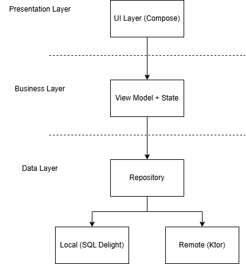

# 🌌 Synesthesia - AI-Powered Visual Journal Super-App


**Synesthesia** is an immersive, intelligent journaling ecosystem built with **Kotlin Multiplatform (KMP)**. It transforms traditional note-taking into a celestial sensory experience, blending state-of-the-art AI analysis with a dynamic visual language that responds to your emotional state.

---

## 📺 Visual Showcase

| ☀️ Daylight Mode (Normal) | 🌌 Astronomy Mode (Space) |
| :---: | :---: |
|  |  |
| *Clean interface with dynamic sky* | *Immersive galaxy with starfields* |

| 🧘 Sanctuary (Mindfulness) | 📊 Insights (Analytics) |
| :---: | :---: |
|  |  |
| *Interactive breathing & meditation* | *Real-time data-driven mood trends* |

### 🎥 Video Demos

| 🛠️ Software Testing Results | ✨ UI/UX Experience |
| :---: | :---: |
| [](https://youtu.be/oN2sHhMo2hg) | [](https://youtube.com/shorts/FZ3bgCcHjKI) |
| *Automated test execution & validation* | *Cinematic transitions & AI resonance* |

### 🎬 Final Presentation Video

Link: https://youtu.be/iNteER9tvJU

---

## ✅ Sprint Deliverables & Progress

### 🚀 Sprint 1: Foundation (100% Complete)
- [x] **Clean Architecture Setup**: Implementation of Presentation, Domain, and Data layers.
- [x] **KMP Project Core**: Cross-platform configuration for Android and iOS.
- [x] **Dependency Injection**: Full integration using Koin (+10% Bonus).
- [x] **Local Persistence**: SQLDelight database configuration.

### 🚀 Sprint 2: Core Features & UI Overhaul (100% Complete)
- [x] **Celestial Design System**: Implementation of dynamic Starfield and Daylight Sky backgrounds.
- [x] **Guided Journaling**: Two-step flow for emotion-focused memory creation.
- [x] **AI Resonance Engine**: Automated title generation and content paraphrasing via Gemini API.
- [x] **Interactive Galaxy**: 3D-effect Constellation Canvas for memory visualization.

### 🚀 Sprint 3: Advanced Intelligence & UX (100% Complete)
- [x] **Advanced Analytics**: Interactive Mood Calendar and color-coded real-time charts.
- [x] **Offline Resilience**: Real-time network monitoring with "Offline Save" fallback capability.
- [x] **Smart Wellness**: AI-driven ritual matching and 5-4-3-2-1 Grounding exercises.
- [x] **Local Audio Engine**: Offline-first ambient playback for Sonic Zen.
- [x] **Search & Filter**: High-performance pill-shaped search with category filtering and multi-sort.

### 🚀 Sprint 4: Stability & Testing (100% Complete)
- [x] **Comprehensive Testing Suite**: Expanded Unit, UseCase, and UI testing (45+ Unit Tests, 3+ UI Tests).
- [x] **Automated Coverage**: Kover integration achieving **79.5% Line Coverage** (Exceeding the 70% bonus target).
- [x] **Visual Polish & Edge Cases**: Minimalist error/loading/empty states across all screens with Skeleton support.
- [x] **Critical Bug Fixes**: Resolved nested coroutine, calendar offset, stale data, and text overflow issues.

### 🚀 Sprint 5: Advanced Experience (100% Complete)
- [x] **Sensory Interaction**: Haptic feedback integration and dynamic Shooting Star animations.
- [x] **Cinematic Navigation**: Shared Element Transitions between galaxy and detail views.
- [x] **User Onboarding**: Immersive 3-slide introduction to the Synesthesia ecosystem.
- [x] **Platform Integration**: Android Home Screen Widget (Glance) and daily Journaling Reminders.
- [x] **Utility Features**: Cross-platform memory sharing (native Intent sharing).

---

## 🧪 Software Testing & QA

Synesthesia emphasizes reliability through a rigorous testing strategy:

### 1. Running Unit Tests
To execute all local unit tests (Domain & Presentation):
```bash
./gradlew :composeApp:testDebugUnitTest
```
**Current Status**: 45/45 Passed ✅

### 2. Code Coverage Report
We use **Kover** to measure test coverage. 


To generate the HTML report locally:
```bash
./gradlew :composeApp:koverHtmlReport
```
The report will be available at `composeApp/build/reports/kover/html/index.html`.

### 3. Running UI Tests
To run instrumentation tests on an Android device/emulator:
```bash
./gradlew connectedDebugAndroidTest
```

---

## 🏗️ Architecture & Technology Stack

### Architecture Diagram


### Technical Overview
Synesthesia is built following **Clean Architecture** principles to ensure a scalable and maintainable codebase:
-   **Presentation**: Compose Multiplatform with MVVM (StateFlow/SharedFlow).
-   **Domain**: Pure Kotlin business logic, Interactors (Use Cases), and Repository Interfaces.
-   **Data**: SQLDelight (Local), Ktor (Remote API), and DataStore (Preferences).

### Core Stack
| Layer | Technology |
|---|---|
| **Language** | Kotlin (100%) |
| **Framework** | Compose Multiplatform (1.7.0) |
| **Dependency Injection** | Koin (4.0.0) |
| **AI Integration** | Google Gemini API (Model: 2.5-flash) |
| **Database** | SQLDelight (2.0.2) |
| **Networking** | Ktor Client (3.0.1) |
| **Concurrency** | Kotlin Coroutines & Flow |

---

## 🛠️ Setup Instructions

1.  **Clone the Repository**
    ```bash
    git clone https://github.com/GarsRayy/NoteAI-Synesthesia.git
    ```
2.  **API Key Configuration**
    Add `GEMINI_API_KEY=your_key_here` to your `local.properties` file.
3.  **Environment**
    Recommended IDE: **Android Studio Ladybug (2024.2.1) or newer**.
4.  **Run Application**
    Execute the Gradle task `:composeApp:installDebug` for Android or the corresponding iOS target.

---
*Developed with ❤️ as a major project for Mobile Application Development - ITERA.*
