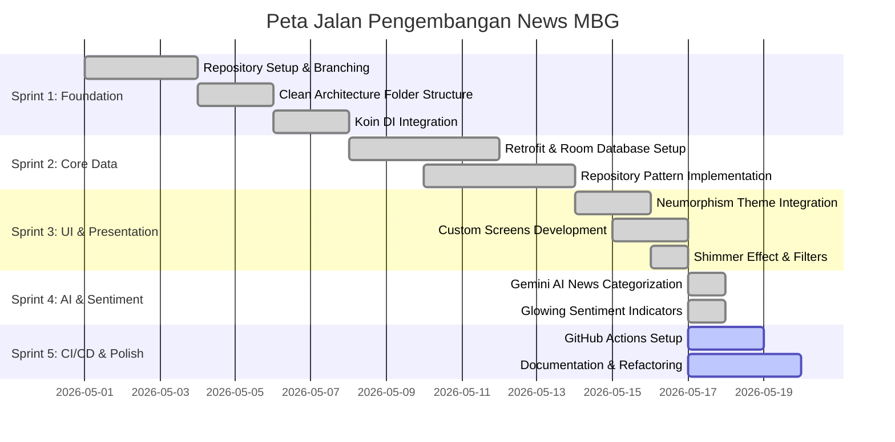

# 📋 Project Plan - News MBG (Sprint 1-5)

Proyek ini adalah aplikasi berita Android modern bernama **News MBG** (Mbgnews) yang dibangun dengan menggunakan prinsip **Clean Architecture**, **Jetpack Compose** untuk antarmuka pengguna premium bergaya **Neumorphism**, **Koin** sebagai Dependency Injection framework, dan terintegrasi dengan **Gemini AI** untuk klasifikasi kategori otomatis serta analisis sentiment secara real-time.

---

## 👥 Profil Kelompok & Pembagian Peran

| Nama Anggota | NIM | Peran Utama | Tanggung Jawab Spesifik |
|--------------|-----|-------------|-------------------------|
| **Febrian Valentino Nugroho** | `123140034` | **Lead Developer & UI/UX Specialist** | Arsitektur utama, integrasi Gemini AI, desain tema Neumorphism, setup Koin DI, integrasi Retrofit & OkHttp, Navigation Graph. |
| **Jonathan Pande Sinaga** | `123140153` | **Data & Storage Engineer** | Setup local database (Room), pembuatan Entity, DAO, implementasi Repository Pattern, penanganan local data caching. |

---

## 🏗️ Peta Jalan Pengembangan (Sprint Milestones)

### 1. Sprint 1: Foundation (Selesai)
*   **Tujuan**: Setup dasar project, arsitektur, dan dependency injection.
*   **Pekerjaan**:
    *   Setup Repository kelompok dan branching dengan format `project/123140034-123140131-Mbgnews`.
    *   Inisialisasi folder **Clean Architecture** (`data`, `domain`, `presentation`, `ui`, `di`).
    *   Setup **Koin Dependency Injection** modul (`databaseModule`, `networkModule`, `repositoryModule`, `useCaseModule`, `viewModelModule`).
    *   Integrasi awal Room Database & Retrofit.

### 2. Sprint 2: Core Data & Storage (Selesai)
*   **Tujuan**: Implementasi data-source (remote & local) serta sinkronisasi data (caching).
*   **Pekerjaan**:
    *   Setup `NewsApi` menggunakan Retrofit untuk fetch data berita.
    *   Setup `NewsDatabase` dengan Room untuk persistence lokal (offline support).
    *   Implementasi `NewsRepositoryImpl` yang menjembatani database lokal dan REST API.
    *   Implementasi `GetMbgNewsUseCase` untuk memproses business logic berita.

### 3. Sprint 3: Premium UI & Navigation (Selesai)
*   **Tujuan**: Pembuatan antarmuka visual yang menawan dengan gaya modern Neumorphism.
*   **Pekerjaan**:
    *   Pembuatan custom **Neumorphic Modifier** (`neumorphicShadow` & `neumorphicShadowColor`) untuk menghasilkan efek bayangan timbul-tenggelam yang dinamis.
    *   Implementasi **Splash Screen** dengan logo MBG Neumorphic dan transisi otomatis.
    *   Implementasi **Home Screen** dengan Search Bar bergaya Neumorphism, filter kategori horizontal, dan efek **Shimmer Loading** yang sangat halus.
    *   Desain **Detail Screen** yang bersih, menampilkan gambar berita, judul, tanggal, dan ringkasan isi berita.
    *   Implementasi **Bottom Navigation** premium dengan ikon bergaya Outlined (Lucide-style).

### 4. Sprint 4: AI Integration & Sentiment Analysis (Selesai)
*   **Tujuan**: Meningkatkan fungsionalitas aplikasi dengan bantuan AI untuk kategorisasi pintar dan analisis sentimen berita.
*   **Pekerjaan**:
    *   Integrasi **Gemini AI Service** (`GeminiService.kt`) dengan API Key AI Studio.
    *   Klasifikasi kategori cerdas berdasarkan isi berita secara real-time.
    *   Pembuatan **Glowing Sentiment Indicators** (Merah untuk negatif, Hijau untuk positif, Abu-abu untuk netral) di Detail Screen, dianalisis secara instan oleh Gemini AI.
    *   Pembersihan dependensi dan perbaikan bug data model consistency.

### 5. Sprint 5: CI/CD & Final Documentation (Sedang Berjalan)
*   **Tujuan**: Automatisasi build untuk memastikan stabilitas kode dan penyusunan dokumentasi lengkap.
*   **Pekerjaan**:
    *   Pembuatan GitHub Actions workflow (`.github/workflows/android.yml`) untuk build verifikasi otomatis pada setiap push dan pull request.
    *   Integrasi Build Badge pada `README.md`.
    *   Penyusunan file `PROJECT_PLAN.md` dan pembaruan `README.md` dengan detail proyek News MBG.

---

## 🛠️ Detail Arsitektur & Teknologi

Aplikasi ini menggunakan model **Clean Architecture** yang terbagi menjadi tiga layer utama:

1.  **Data Layer**:
    *   `NewsApi`: Interface Retrofit untuk berkomunikasi dengan NewsAPI.
    *   `GeminiService`: Integrasi dengan SDK Generative AI Google Gemini.
    *   `NewsDatabase` & `ArticleDao`: Local persistence Room Database untuk caching offline.
    *   `NewsRepositoryImpl`: Implementasi repository yang menggabungkan remote caching dan local storage.
2.  **Domain Layer**:
    *   `Article` & `NewsResponse`: Pure Kotlin data models.
    *   `NewsRepository`: Abstraksi data-access interface.
    *   `GetMbgNewsUseCase`: Menangani query pencarian berita dan caching logic.
3.  **Presentation Layer**:
    *   `NewsViewModel`: Menangani state management (`NewsUiState`) dengan menggunakan `StateFlow`.
    *   `HomeScreen`, `DetailScreen`, `BookmarkScreen`, `AboutScreen`: Menggambar UI menggunakan Jetpack Compose.
    *   `NavGraph` & `Screen`: Menggunakan Type-safe Compose Navigation.

---

## 📈 Strategi Git & Kolaborasi

*   **Pemberian Nama Branch**: Nama branch utama kelompok didefinisikan sebagai `project/123140034-123140131-Mbgnews` pada repository upstream (lecturer) dan `123140034-123140131-Mbgnews` secara lokal & origin.
*   **Proses Integrasi**:
    1.  Developer berkolaborasi pada repository origin `Febvn/Proyek-Pengembangan-Aplikasi-Mobile`.
    2.  Setiap fitur atau perbaikan di-commit dengan deskripsi yang deskriptif dan profesional.
    3.  Setelah build CI/CD sukses diverifikasi oleh GitHub Actions, perubahan disinkronkan dan dikirimkan ke upstream menggunakan Pull Request.
