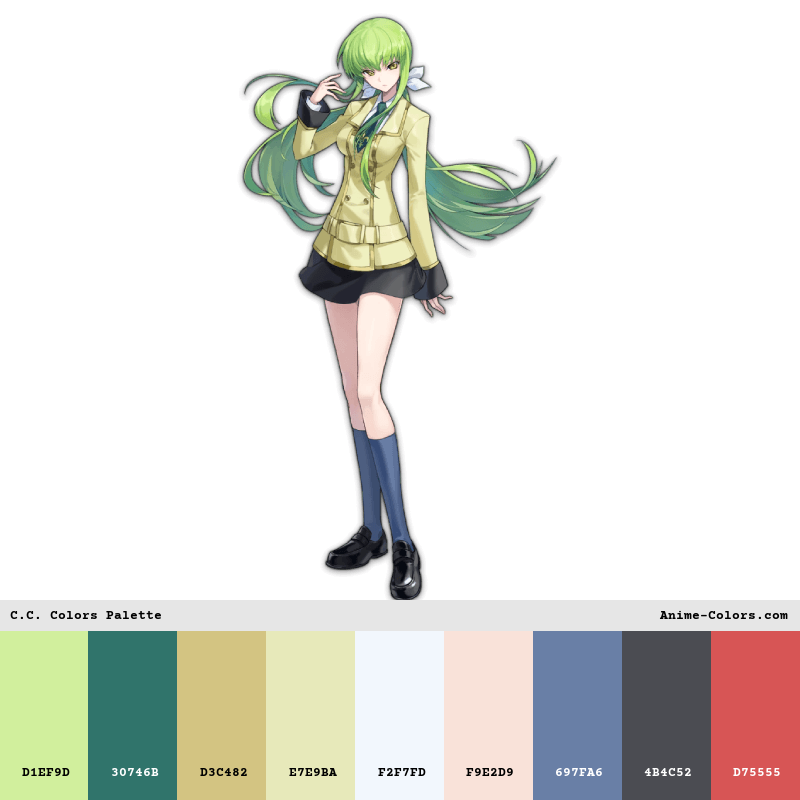
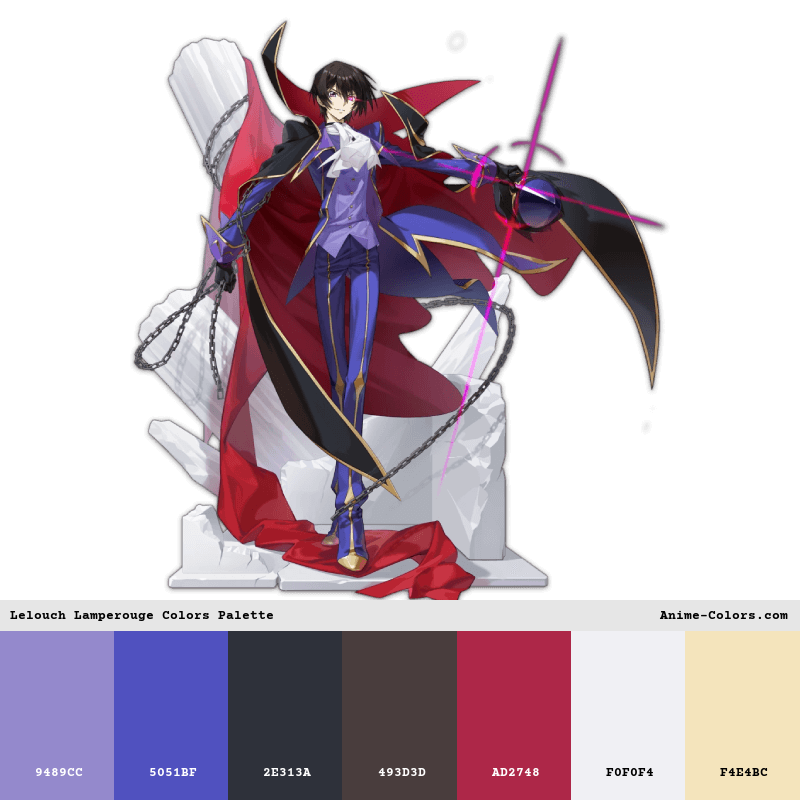

# Code Geass Color Palletes
color pallete yang kami gunakan terinsipirasi dan kami modifikasi sedemikian dari 
1. C.C = https://www.anime-colors.com/code-geass-series/c-c 

2. Lelouch Lamperouge =  https://www.anime-colors.com/code-geass-series/lelouch-lamperouge

---

# Color Table
berikut adalah tabel color dari kami ambil, modifikasi, dan tambahkan:

## C.C (Light Theme)

1. Asli (dari anime-colors)

| Komponen MD3 | Hex Code |
| :--- | :--- |
| Primary | `#30746B` |
| PrimaryContainer | `#D1EF9D` |
| Secondary | `#697FA6` |
| TertiaryContainer | `#E7E9BA` |
| Error | `#D75555` |
| Background / Surface | `#F2F7FD` |
| OnBackground / OnSurface | `#4B4C52` |

2. Tambahan & Modifikasi

| Komponen MD3 | Hex Code |
| :--- | :--- |
| Tertiary | `#B3A45C` |
| OnPrimary / OnSecondary | `#FFFFFF` |
| OnPrimaryContainer | `#09201D` |
| SecondaryContainer | `#D9E2F2` |
| OnSecondaryContainer | `#172033` |
| OnTertiaryContainer | `#212300` |
| SurfaceVariant | `#DFE3EB` |
| OnSurfaceVariant | `#44474E` |
| Outline | `#74777F` |

---

## Lelouch Lamperouge (Dark Theme)

1. Asli (dari anime-colors)

| Komponen MD3 | Hex Code |
| :--- | :--- |
| Primary | `#9489CC` |
| PrimaryContainer | `#5051BF` |
| Secondary | `#F4E4BC` |
| SecondaryContainer | `#493D3D` |
| TertiaryContainer | `#AD2748` |
| Background / Surface | `#2E313A` |
| OnBackground / OnSurface | `#F0F0F4` |

2. Tambahan & Modifikasi

| Komponen MD3 | Hex Code |
| :--- | :--- |
| OnSecondaryContainer | `#F4E4BC` |
| Tertiary | `#D4718A` |
| OnPrimary | `#20155A` |
| OnPrimaryContainer | `#E0E0FF` |
| OnSecondary | `#3A300E` |
| OnTertiary | `#3F0015` |
| OnTertiaryContainer | `#FFD9E2` |
| SurfaceVariant | `#454854` |
| OnSurfaceVariant | `#C6C8D3` |
| Outline | `#90929D` |

---

# Disclaimer
jika ada pelanggaran terhadap hak cipta (DMCA), penggunaan, dan lain lain.
silakan ajukan keluhan ke Varasina Farmadani (sina@sinanonym.my.id), atau Faiq Ghozy Erlangga (ghozyerlanggafaiq@gmail.com).
